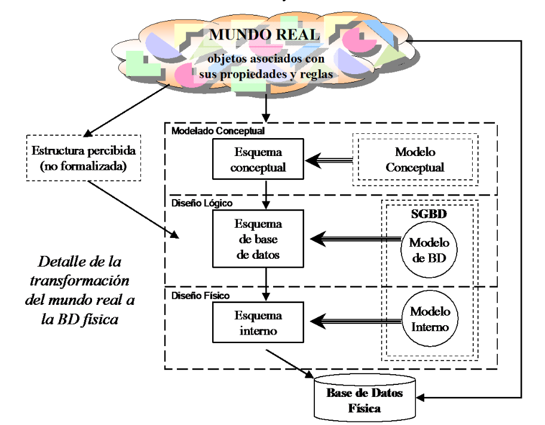
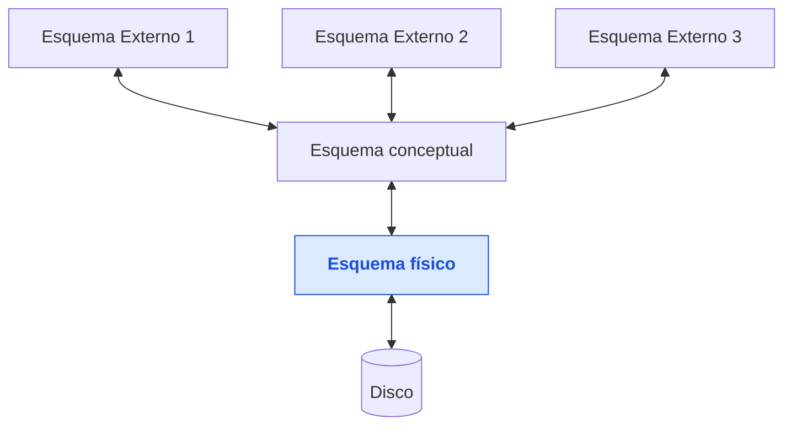
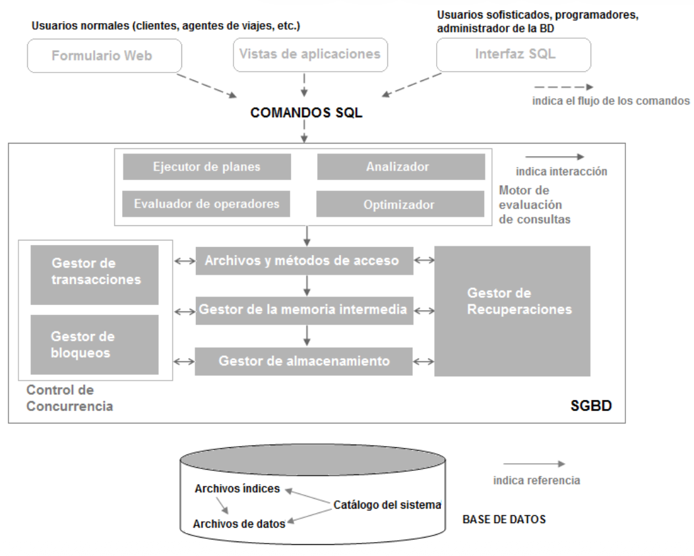

# Unidad I: Introducción a las Bases de Datos

> **Gestión de Datos** — Ingeniería en Sistemas de Información, UTN-FRRE Profesora: Ing. Carolina
> Orcola · Jefe de T.P.: Ing. Luis Eiman · Auxiliar: Juan Carlos Fernández

---

## Índice

- [Unidad I: Introducción a las Bases de Datos](#unidad-i-introducción-a-las-bases-de-datos)
  - [Índice](#índice)
  - [Introducción](#introducción)
  - [Funciones de un SGBD](#funciones-de-un-sgbd)
  - [Ventajas de los SGBD](#ventajas-de-los-sgbd)
  - [Descripción y almacenamiento de datos en los SGBD](#descripción-y-almacenamiento-de-datos-en-los-sgbd)
    - [Visión de los datos](#visión-de-los-datos)
    - [Nivel de Abstracción de SGBD](#nivel-de-abstracción-de-sgbd)
    - [Independencia de datos](#independencia-de-datos)
  - [Lenguaje de Base de Datos](#lenguaje-de-base-de-datos)
    - [Lenguaje de definición de datos (LDD)](#lenguaje-de-definición-de-datos-ldd)
    - [Lenguaje de manipulación de datos (LMD)](#lenguaje-de-manipulación-de-datos-lmd)
  - [Gestión de transacciones](#gestión-de-transacciones)
  - [Gestión de almacenamiento](#gestión-de-almacenamiento)
  - [Arquitectura de los SGBD](#arquitectura-de-los-sgbd)
  - [Administrador de Base de Datos](#administrador-de-base-de-datos)
  - [Usuarios de Base de Datos](#usuarios-de-base-de-datos)
  - [Bibliografía](#bibliografía)

---

## Introducción

El concepto de Base de Datos surgió a fines de la década del 60 como propuesta de solución a un
conjunto de problemas técnicos y administrativos presentados en el manejo de archivos. El sistema de
procesamiento de archivos típico se mantenía mediante un sistema operativo convencional. Los
registros permanentes se almacenaban en varios archivos y se escribían diferentes programas de
aplicación para extraer registros y para analizar registros a los archivos adecuados.

A medida que los sistemas de información se volvían más complejos y se extendían a nuevas áreas de
la operación de una empresa, las dificultades de mantener su funcionamiento y costo bajo control se
acentuaban. Todo esto llevó a que surgieran problemas como:

- Redundancias e inconsistencia de datos
- Dificultad en el acceso a los datos
- Aislamiento de datos
- Problemas de integridad
- Problemas de atomicidad
- Anomalías en el acceso concurrente
- Problemas de seguridad

Para tratar de evitar este tipo de problemas, la tecnología de Base de Datos hace la siguiente
propuesta: tomar el conjunto de toda la información relevante a la operación de una organización
(por ejemplo, en un Banco: CLIENTES, CUENTAS, EMPLEADOS, etc.) y colocarla, apropiadamente
organizada y codificada, en un reservorio llamado **Base de Datos**.

> **Base de Datos:** conjunto de datos relacionados entre sí, que pueden ser de cualquier tamaño y
> tener diversos grados de amplitud.

Ningún programa de aplicación tendrá acceso directo a los archivos que componen la Base de Datos. En
su lugar se interpone entre esos archivos y los programas de aplicación un nuevo nivel de software
llamado **Sistema de Gestión de Base de Datos (SGBD)**. El SGBD provee acceso a la información a un
alto nivel de abstracción: en lugar de manipular archivos, registros e índices, el programa de
aplicación se maneja enteramente en términos de CLIENTES, CUENTAS, SALDOS, etc., que son traducidos
por el SGBD a su implementación física.

Un SGBD consiste en una colección de datos interrelacionados y un conjunto de programas para acceder
a dichos datos. El control de la Base de Datos está centralizado en el **Administrador de Base de
Datos**, quien es responsable de definir, mantener y garantizar su integridad y seguridad.

---

## Funciones de un SGBD

Las funciones provistas por un SGBD se pueden agrupar en tres clases:

- **Consulta y actualización de los datos:** conjunto de herramientas que permite a los distintos
  tipos de usuario extraer, manipular y modificar la información almacenada en la Base de Datos.

- **Mantenimiento de esquemas:** el esquema de la Base de Datos es la descripción de la estructura
  de la información almacenada en ella. Para un sistema basado en tablas, el esquema puede consistir
  en una lista de tablas, los campos que contienen, el tipo de datos de cada campo, descripciones
  del propósito de cada tabla y restricciones sobre los valores admisibles.

- **Gestión de transacciones:** una transacción es un programa de aplicación, generalmente de
  duración breve, que accede y actualiza una parte de la Base de Datos. La gestión de transacciones
  controla múltiples transacciones ejecutándose en paralelo sobre una misma Base de Datos,
  encargándose del control de concurrencia y de técnicas de recuperación ante fallos.

---

## Ventajas de los SGBD

- **Independencia con respecto a los datos:** los programas de las aplicaciones no se exponen a los
  detalles de representación y almacenamiento de los datos. El SGBD ofrece una vista abstracta que
  oculta esos detalles.

- **Acceso eficiente a los datos:** los SGBD emplean técnicas sofisticadas para almacenar y
  recuperar datos de manera eficiente, especialmente importante cuando los datos se guardan en
  dispositivos externos.

- **Integridad y seguridad de los datos:** el SGBD puede hacer cumplir restricciones de integridad
  (ej.: verificar que no se supere el presupuesto de un departamento antes de introducir información
  salarial) y controles de acceso que determinan los datos visibles para cada clase de usuario.

- **Administración de archivos:** la centralización de la administración de datos permite que
  profesionales especializados organicen la representación de los datos para minimizar la
  redundancia y mejorar la eficiencia de recuperación.

- **Acceso concurrente y recuperación ante fallos:** los SGBD programan los accesos concurrentes de
  tal manera que los usuarios perciban acceso exclusivo a los datos, y protegen contra los efectos
  de fallos del sistema.

- **Reducción del tiempo de desarrollo de aplicaciones:** el SGBD soporta funciones comunes a muchas
  aplicaciones, facilitando el desarrollo rápido y produciendo aplicaciones más robustas.

A pesar de estas ventajas, pueden existir razones para no usar SGBD: aplicaciones con estrictas
restricciones de tiempo real, pocas operaciones críticas bien definidas que requieran código a
medida, o necesidades de manipulación de datos no soportadas por el lenguaje de consultas.

---

## Descripción y almacenamiento de datos en los SGBD

Los SGBD permiten a los usuarios definir los datos a almacenar en términos de un **modelo de
datos**: un conjunto de estructuras descriptivas de alto nivel que ocultan los detalles de
almacenamiento de bajo nivel. La mayoría de los SGBD se basan en el **Modelo Relacional de Datos**.

### Visión de los datos

El propósito principal de un SGBD es proporcionar a los usuarios una **visión abstracta de los
datos**: el sistema esconde los detalles de cómo se mantienen y almacenan los datos.

### Nivel de Abstracción de SGBD

Para que el sistema sea útil debe recuperar datos eficientemente. Esta preocupación condujo al
diseño de estructuras de datos complejas, cuya complejidad se oculta a los usuarios a través de
varios niveles de abstracción:

| Nivel                   | Descripción                                                                                                                        |
| ----------------------- | ---------------------------------------------------------------------------------------------------------------------------------- |
| **Físico**              | El más bajo. Describe cómo se almacenan realmente los datos (estructuras de datos de bajo nivel).                                  |
| **Lógico o Conceptual** | Describe qué datos se almacenan y qué relaciones existen entre ellos. Es el nivel de interés para administradores y programadores. |
| **Vistas o Externo**    | El más alto. Describe solo parte de la Base de Datos. Permite definir múltiples vistas para distintos grupos de usuarios.          |

### Independencia de datos

Capacidad para modificar una definición de esquema en un nivel sin afectar la definición de esquema
en el siguiente nivel más alto. Hay dos tipos:

- **Independencia física de datos:** capacidad para modificar el esquema físico sin reescribir los
  programas de aplicación (ej.: modificar estructuras de almacenamiento o métodos de acceso).

- **Independencia lógica de datos:** capacidad para modificar el esquema conceptual sin reescribir
  los programas de aplicación (ej.: agregar o quitar entidades). Es más difícil de lograr que la
  independencia física, ya que los programas de aplicación son fuertemente dependientes de la
  estructura lógica de los datos.

---

## Lenguaje de Base de Datos

Un SGBD proporciona dos tipos de lenguaje:

### Lenguaje de definición de datos (LDD)

Un esquema de Base de Datos se especifica mediante un conjunto de definiciones expresadas en el LDD.
El resultado de su compilación es un conjunto de tablas almacenadas en el **diccionario de datos**,
un archivo que contiene datos acerca de los datos y que se consulta antes de leer o modificar los
datos reales del SGBD.

### Lenguaje de manipulación de datos (LMD)

Por manipulación de datos se entiende:

- La recuperación de información almacenada en la Base de Datos.
- La inserción de información nueva.
- El borrado de información.
- La modificación de información almacenada.

Hay dos tipos básicos de LMD:

- **LMD procedimentales:** el usuario especifica qué datos se necesitan **y cómo** obtenerlos.
- **LMD no procedimentales:** el usuario especifica qué datos se necesitan, **sin especificar cómo**
  obtenerlos.

Una **consulta** es una instrucción para recuperar información. La parte del LMD que implica
recuperación se llama **lenguaje de consulta**. El modelo relacional soporta lenguajes de consulta
muy potentes:

- **Cálculo relacional:** lenguaje de consultas formal basado en la lógica matemática.
- **Álgebra relacional:** basado en un conjunto de operadores para la manipulación de relaciones;
  equivalente en potencial al cálculo relacional.

---

## Gestión de transacciones

Una **transacción** es una colección de operaciones que se llevan a cabo como una función lógica
simple en una aplicación del SGBD. Cada transacción es una unidad de **atomicidad** y
**consistencia**: si la Base de Datos era consistente cuando la transacción comenzó, debe seguir
siendo consistente cuando finalice.

Asegurar atomicidad y durabilidad es responsabilidad del componente de **gestión de transacciones**.
Si una transacción falla, no debe tener efecto en el estado de la Base de Datos (la Base de Datos se
restaura al estado previo al inicio de la transacción).

> **Ejemplo:** si el SGBD transfiere dinero de la cuenta A a la cuenta B y carga la cuenta A pero
> falla antes de acreditar la cuenta B, debe devolver el dinero a la cuenta A al recuperarse del
> fallo.

El SGBD mantiene un registro de todas las operaciones de escritura. Una propiedad fundamental es que
cada acción de escritura debe registrarse **antes** de que la modificación se refleje en la base de
datos: esto se denomina **registro de escritura previa (Write-Ahead Log, WAL)**.

Cuando varias transacciones actualizan la Base de Datos concurrentemente, el SGBD gestiona sus
solicitudes para evitar conflictos (ej.: que dos agentes de viajes vendan la misma plaza de un vuelo
a dos personas diferentes). El SGBD logra esto usando:

- **Bloqueo compartido:** permite a dos transacciones bloquear un objeto al mismo tiempo.
- **Bloqueo exclusivo:** solo una transacción puede actuar sobre el mismo objeto por vez.

---

## Gestión de almacenamiento

Las Bases de Datos requieren normalmente una gran cantidad de espacio de almacenamiento. Como la
memoria principal no puede almacenar tanta información, los datos se almacenan en disco y se
trasladan a memoria cuando se necesitan. Como la transferencia de datos a/desde disco es lenta
comparada con la velocidad de la CPU, el SGBD debe estructurar los datos para minimizar ese
movimiento.

---

## Arquitectura de los SGBD

El SGBD acepta órdenes SQL generadas por diversas interfaces de usuario, produce planes de
evaluación de consultas, los ejecuta contra la base de datos y devuelve las respuestas.

Cuando un usuario formula una consulta:

1. La consulta es analizada y enviada al **optimizador de consultas**, que produce un **plan de
   ejecución** eficiente (árbol de operadores relacionales).
2. El código de los operadores relacionales se sitúa sobre la capa de **archivos y métodos de
   acceso**, que soporta archivos de montículo (páginas sin ordenar) e índices.
3. Esa capa se apoya sobre el **gestor de la memoria intermedia**, que lleva páginas del disco a
   memoria principal.
4. La capa inferior es el **gestor de almacenamiento**, responsable de la administración del espacio
   en disco.

Los componentes asociados al control de concurrencia y recuperación son:

| Componente                   | Función                                                                                                                  |
| ---------------------------- | ------------------------------------------------------------------------------------------------------------------------ |
| **Gestor de transacciones**  | Garantiza que las transacciones soliciten y liberen bloqueos según el protocolo correspondiente y programa su ejecución. |
| **Gestor de bloqueos**       | Realiza seguimiento de solicitudes de bloqueo y los concede cuando quedan disponibles.                                   |
| **Gestor de recuperaciones** | Mantiene el registro (log) y restaura el sistema a un estado consistente tras fallos.                                    |

---

## Administrador de Base de Datos

La persona con control central sobre el sistema se llama **Administrador de Base de Datos (DBA)**.
Sus funciones incluyen:

- **Definición del esquema:** crea el esquema original escribiendo definiciones que el compilador
  del LDD traduce a tablas en el diccionario de datos.
- **Estructura de almacenamiento y método de acceso:** crea las estructuras de almacenamiento
  apropiadas y los métodos de acceso.
- **Modificación del esquema y la organización física:** adapta las decisiones anteriores a medida
  que cambian los requerimientos y el entorno.
- **Autorización de acceso a los datos:** determina qué usuarios tendrán acceso a qué información y
  de qué tipo (solo lectura, acceso irrestricto, sin conocimiento de la existencia de ciertas
  tablas, etc.).
- **Especificación de restricciones de integridad:** define las reglas que restringen los valores
  legales en la Base de Datos; el sistema las consulta ante cada actualización.

---

## Usuarios de Base de Datos

| Tipo de usuario                 | Descripción                                                                                                                                         |
| ------------------------------- | --------------------------------------------------------------------------------------------------------------------------------------------------- |
| **Programadores de aplicación** | Profesionales informáticos que interactúan mediante llamadas del LMD incluidas en programas escritos en un lenguaje anfitrión (Cobol, C, C#, etc.). |
| **Usuarios sofisticados**       | Interactúan sin programas escritos, formulando consultas directamente en un lenguaje de consulta de Base de Datos.                                  |
| **Usuarios normales**           | Usuarios no sofisticados que interactúan mediante programas de aplicación permanentes escritos previamente.                                         |

---

## Bibliografía

1. Ramakrishnan, R. y Gehrke, J. — _Sistema de Administración de Bases de Datos_, Mc Graw Hill, 3ª
   edición en español, 2007.
2. Elmasri y Navathe — _Fundamentos de Sistemas de Bases de Datos_, Addison Wesley, 3ª edición,
   Madrid, 2002.
3. Mendelzon y Ale — _Introducción a las bases de datos relacionales_, Prentice Hall, 1ª edición,
   Argentina, 2000.
4. Piattini, M. M. — _Concepto y diseño de bases de datos_, Addison-Wesley.
5. Korth, F. H. — _Fundamentos de base de datos_, McGraw Hill, 3ª edición, 1998.
6. Date, C. J. — _Introducción a los sistemas de base de datos_, Prentice-Hall, 7ª edición, 2001.
7. Elmasri y Navathe — _Sistemas de Bases de Datos – Conceptos fundamentales_, Addison Wesley, 2ª
   edición, Madrid, 1994.
