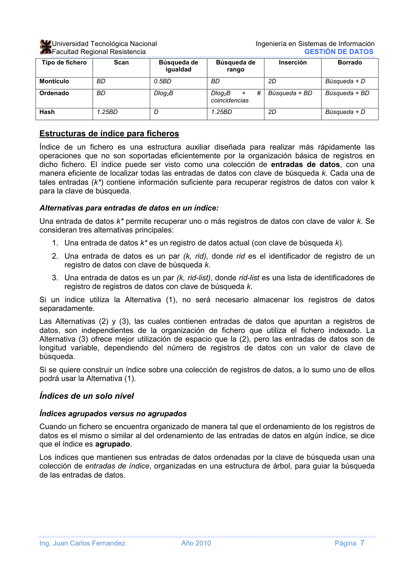
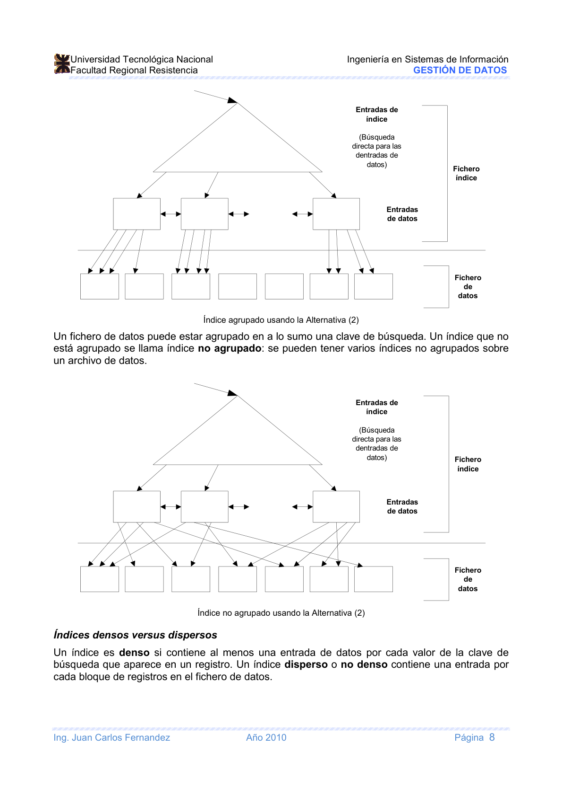
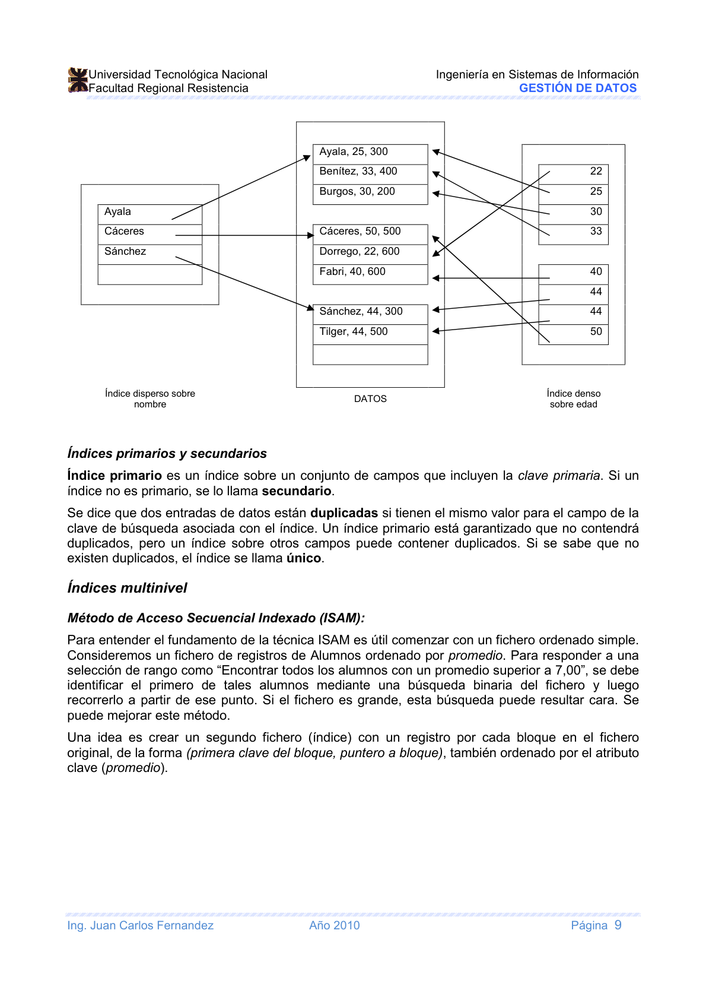
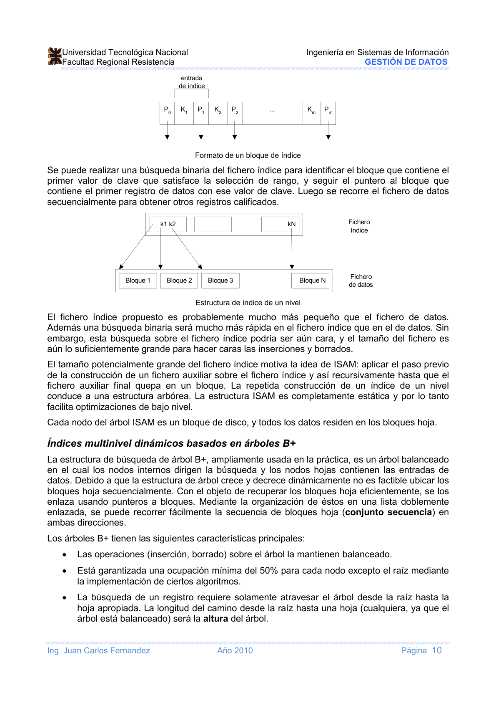
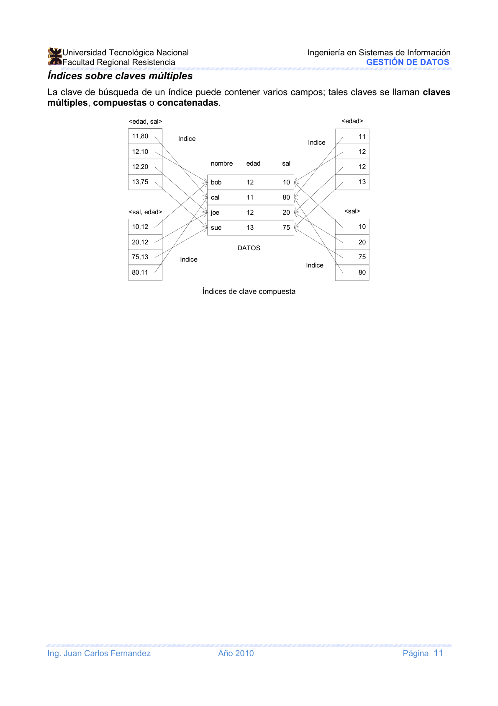

# Unidad II: Almacenamiento de Registros y Organización de Ficheros

> **Gestión de Datos** — Ingeniería en Sistemas de Información, UTN-FRRE
>
> Profesora: Ing. Carolina Orcola
>
> Jefe de T.P.: Ing. Luis Eiman
>
> Auxiliar: Juan Carlos Fernández

---

## Índice

- [Unidad VI: Almacenamiento de Registros y Organización de Ficheros](#unidad-vi-almacenamiento-de-registros-y-organización-de-ficheros)
  - [Índice](#índice)
  - [Introducción](#introducción)
    - [Jerarquías de memoria y dispositivos de almacenamiento](#jerarquías-de-memoria-y-dispositivos-de-almacenamiento)
    - [Almacenamiento de base de datos](#almacenamiento-de-base-de-datos)
  - [Dispositivos de almacenamiento secundario](#dispositivos-de-almacenamiento-secundario)
  - [Almacenamiento intermedio de bloques](#almacenamiento-intermedio-de-bloques)
  - [Grabación de registros en disco](#grabación-de-registros-en-disco)
    - [Registros y tipos de registros](#registros-y-tipos-de-registros)
    - [Ficheros de longitud fija y variable](#ficheros-de-longitud-fija-y-variable)
    - [Grabación de registros en bloques](#grabación-de-registros-en-bloques)
    - [Asignación en disco de bloques](#asignación-en-disco-de-bloques)
  - [Operaciones con ficheros](#operaciones-con-ficheros)
  - [Estructuras de índice para ficheros](#estructuras-de-índice-para-ficheros)
    - [Alternativas para entradas de datos](#alternativas-para-entradas-de-datos)
    - [Índices de un solo nivel](#índices-de-un-solo-nivel)
      - [Índices agrupados versus no agrupados](#índices-agrupados-versus-no-agrupados)
      - [Índices densos versus dispersos](#índices-densos-versus-dispersos)
      - [Índices primarios y secundarios](#índices-primarios-y-secundarios)
    - [Índices multinivel — ISAM](#índices-multinivel--isam)
    - [Índices multinivel dinámicos — Árbol B+](#índices-multinivel-dinámicos--árbol-b)
    - [Índices sobre claves múltiples](#índices-sobre-claves-múltiples)
  - [Bibliografía](#bibliografía)

---

## Introducción

La colección de datos que conforma una base de datos debe almacenarse físicamente en algún medio de
almacenamiento de la computadora. Estos medios forman una jerarquía con dos categorías principales:

- **Almacenamiento primario**: incluye medios sobre los cuales la CPU puede operar directamente
  (memoria principal y caché). Ofrece acceso rápido pero capacidad limitada.
- **Almacenamiento secundario**: incluye discos magnéticos, discos ópticos y cintas. Mayor capacidad
  y menor costo, pero acceso más lento. La CPU debe copiar los datos al almacenamiento primario
  antes de operar.

### Jerarquías de memoria y dispositivos de almacenamiento

Los medios de almacenamiento presentan una relación inversa entre precio/velocidad y capacidad.

**Almacenamiento primario** (de mayor a menor costo):

- **Memorias caché**: RAM estática utilizada por la CPU para aumentar la velocidad de ejecución.
- **DRAM (memoria principal)**: proporciona el área de trabajo principal de la CPU. Bajo costo pero
  volátil y más lenta que la caché.

**Almacenamiento secundario**:

- **Discos magnéticos**
- **Dispositivos CD-ROM / DVD**: almacenamiento óptico, capacidad de ~500 MB (CD) a 4–15 GB (DVD).
- **Cintas**: el nivel más barato. Los juke-box de cintas pueden contener varios terabytes; acceso
  off-line.

### Almacenamiento de base de datos

La mayoría de las bases de datos se almacenan en disco magnético porque:

- Son demasiado grandes para caber completas en memoria principal.
- El almacenamiento secundario es **no volátil** (menor riesgo de pérdida permanente de datos).
- El costo de almacenamiento por unidad de datos es menor que en el primario.

Las cintas se usan para respaldo (backup) por su menor costo, aunque su velocidad de acceso es mucho
más lenta y son off-line.

Hay varias **organizaciones primarias de ficheros**:

- **Ficheros de montículo** (no ordenados): registros sin orden específico, nuevos registros al
  final.
- **Ficheros ordenados** (secuenciales): registros ordenados por un campo clave.
- **Ficheros de direccionamiento calculado** (hashing): función hash sobre un campo clave determina
  la ubicación del registro en disco.
- **Árboles B**: otra organización primaria basada en estructuras de árbol.

La **organización secundaria** (estructura de acceso auxiliar) permite accesos eficientes por campos
alternativos al de la organización primaria.

---

## Dispositivos de almacenamiento secundario

Los discos magnéticos son el medio principal para bases de datos. Características relevantes:

- Acceso aleatorio (a diferencia de las cintas que son secuenciales).
- El sistema operativo transfiere datos en unidades llamadas **bloques** o **páginas**.

**RAID** (Redundant Array of Independent Disks): tecnología para acceso paralelo al disco que mejora
rendimiento y/o tolerancia a fallos mediante múltiples discos trabajando en conjunto.

---

## Almacenamiento intermedio de bloques

Cuando es preciso transferir varios bloques del disco a memoria principal y se conocen todas las
direcciones de bloque, es posible reservar varios **búferes** en memoria para agilizar la
transferencia.

- El controlador de disco (procesador de E/S independiente) puede transferir un bloque entre memoria
  y disco en paralelo con la CPU.
- **Doble búfer**: mientras la CPU procesa un bloque ya en memoria, el controlador lee y transfiere
  el siguiente bloque a un búfer diferente. Esto permite solapar lectura y procesamiento.

---

## Grabación de registros en disco

### Registros y tipos de registros

Los datos se almacenan en **registros**, cada uno compuesto de valores o elementos de datos
relacionados. Cada valor corresponde a un **campo** del registro y describe entidades y sus
atributos.

Una colección de nombres de campos y sus tipos constituye una **definición de tipo de registro**
(formato de registro).

### Ficheros de longitud fija y variable

Un **fichero** es una secuencia de registros.

- **Longitud fija**: todos los registros tienen exactamente el mismo tamaño.
- **Longitud variable**: registros de tamaños distintos. Puede deberse a:
  - Uno o más campos de tamaño variable.
  - Uno o más campos con múltiples valores en registros individuales.
  - Uno o más campos opcionales.
  - Registros de diferentes tipos en el mismo fichero.

### Grabación de registros en bloques

Los registros se asignan a **bloques de disco** porque el bloque es la unidad de transferencia entre
disco y memoria. Si el tamaño del bloque es mayor que el del registro, cada bloque contendrá varios
registros.

### Asignación en disco de bloques

Técnicas estándar para asignar bloques en disco:

- **Asignación contigua**: bloques consecutivos del disco. Lectura de todo el fichero ágil con doble
  búfer, pero dificulta la expansión.
- **Asignación enlazada**: cada bloque contiene un puntero al siguiente. Facilita la expansión pero
  vuelve más lenta la lectura.
- **Segmentos de fichero**: grupos de bloques consecutivos enlazados entre sí.
- **Asignación indexada**: uno o más bloques de índice contienen punteros a los bloques del fichero.

---

## Operaciones con ficheros

**Modelo de costo** (para estimar el costo en tiempo de ejecución):

- `B`: número de bloques con `R` registros por bloque.
- `D`: tiempo promedio para leer o escribir un bloque a disco.
- `C`: tiempo promedio para procesar un registro (comparación, etc.).
- `H`: tiempo para aplicar la función hash a un registro (en organización hash).

Valores típicos: `D = 25 ms`, `C` y `H` entre 1 y 10 µs. El costo de E/S de bloques de disco domina
ampliamente.

**Operaciones básicas**:

- **Scan**: recorre todos los registros del fichero llevando cada bloque del disco al búfer.
- **Búsqueda con selección de igualdad**: localiza registros que satisfacen `campo = valor`.
- **Búsqueda con selección de rango**: localiza registros que satisfacen `campo ∈ [a, b]`.
- **Inserción**: identifica el bloque destino, lo trae a memoria, lo modifica y lo escribe de
  vuelta.
- **Borrado**: identifica el bloque que contiene el registro, lo modifica y lo escribe de vuelta.

**Comparación de organizaciones de ficheros**:

| Tipo de fichero | Scan   | Búsqueda igualdad | Búsqueda rango      | Inserción     | Borrado       |
| --------------- | ------ | ----------------- | ------------------- | ------------- | ------------- |
| Montículo       | BD     | 0.5BD             | BD                  | 2D            | Búsqueda + D  |
| Ordenado        | BD     | D·log₂B           | D·log₂B + #coincid. | Búsqueda + BD | Búsqueda + BD |
| Hash            | 1.25BD | D                 | 1.25BD              | 2D            | Búsqueda + D  |

---

## Estructuras de índice para ficheros

Un **índice** es una estructura auxiliar diseñada para realizar más rápidamente las operaciones que
no son soportadas eficientemente por la organización básica del fichero. Se puede ver como una
colección de **entradas de datos** con una manera eficiente de localizar todas las entradas con
clave de búsqueda `k`. Cada entrada `k*` contiene información suficiente para recuperar registros de
datos con valor `k`.

### Alternativas para entradas de datos

1. **Alternativa 1**: la entrada de datos `k*` es el registro de datos completo (con clave `k`). No
   es necesario almacenar los registros por separado.
2. **Alternativa 2**: la entrada de datos es un par `(k, rid)`, donde `rid` es el identificador del
   registro de datos con clave `k`.
3. **Alternativa 3**: la entrada de datos es un par `(k, rid-list)`, donde `rid-list` es una lista
   de identificadores de registros con clave `k`. Mejor utilización de espacio que la Alternativa 2,
   pero entradas de longitud variable.

Las Alternativas 2 y 3 son independientes de la organización del fichero indexado. A lo sumo uno de
los índices sobre un fichero puede usar la Alternativa 1.

### Índices de un solo nivel

#### Índices agrupados versus no agrupados

- **Índice agrupado**: el ordenamiento de los registros de datos coincide con el ordenamiento de las
  entradas del índice. Un fichero puede estar agrupado por a lo sumo una clave de búsqueda.
- **Índice no agrupado**: el ordenamiento de datos no coincide con el del índice. Se pueden tener
  varios índices no agrupados sobre un mismo fichero.

#### Índices densos versus dispersos

- **Índice denso**: contiene al menos una entrada de datos por cada valor de la clave de búsqueda
  que aparece en algún registro.
- **Índice disperso** (no denso): contiene una entrada por cada **bloque** de registros del fichero
  de datos.

#### Índices primarios y secundarios

- **Índice primario**: índice sobre un conjunto de campos que incluyen la clave primaria.
  Garantizado sin duplicados.
- **Índice secundario**: cualquier índice que no es primario. Puede contener duplicados.
- **Índice único**: índice sin duplicados (aunque no sea primario).

### Índices multinivel — ISAM

**ISAM** (Indexed Sequential Access Method): se construye un segundo fichero índice con un registro
por cada bloque del fichero original, de la forma `(primera clave del bloque, puntero a bloque)`,
ordenado por la clave. Esto permite búsqueda binaria sobre el fichero índice (más pequeño) en lugar
del fichero de datos.

Si el fichero índice sigue siendo grande, el proceso se repite recursivamente hasta que el fichero
auxiliar quepa en un bloque. Esto produce una **estructura arbórea**. Cada nodo del árbol ISAM es un
bloque de disco; todos los datos residen en los **bloques hoja**.

La estructura ISAM es completamente **estática**, lo que facilita optimizaciones de bajo nivel pero
dificulta las inserciones y borrados.

### Índices multinivel dinámicos — Árbol B+

El **árbol B+** es un árbol balanceado ampliamente usado en la práctica:

- Los **nodos internos** dirigen la búsqueda.
- Los **nodos hoja** contienen las entradas de datos, enlazados en una **lista doblemente enlazada**
  (conjunto secuencia) para recorrido eficiente en ambas direcciones.

Características principales:

- Las operaciones de inserción y borrado mantienen el árbol **balanceado**.
- Se garantiza una **ocupación mínima del 50%** en cada nodo excepto la raíz.
- La búsqueda requiere recorrer el árbol desde la raíz hasta la hoja apropiada. El costo es
  proporcional a la **altura del árbol**.

A diferencia de ISAM, el árbol B+ crece y decrece **dinámicamente**, lo que lo hace adecuado para
ficheros con muchas inserciones y borrados.

### Índices sobre claves múltiples

La clave de búsqueda puede contener varios campos; tales claves se llaman **claves múltiples**,
**compuestas** o **concatenadas**.

Se pueden crear índices separados para distintas combinaciones de campos o para campos individuales:

- Índice sobre `<edad, sal>`
- Índice sobre `<sal, edad>`
- Índice sobre `<edad>`
- Índice sobre `<sal>`

---

## Bibliografía

1. _"Sistema de Administración de Bases de Datos"_; Raghu Ramakrishnan / Johannes Gehrke; Mc Graw
   Hill, 3ª Edición, edición en español — 2007
2. _"Fundamentos de Sistemas de Bases de Datos"_; Elmasri y Navathe; Addison Wesley; 3ª Edición;
   Madrid; 2002
3. _"Introduction to Database Systems"_; C. J. Date; Addison Wesley; 8ª Edición; 2004
