# Unidad III: Modelado de Datos

> **Gestión de Datos** — Ingeniería en Sistemas de Información, UTN-FRRE
>
> Profesora: Ing. Carolina Orcola
>
> Jefe de T.P.: Ing. Luis Eiman
>
> Auxiliar: Juan Carlos Fernández

---

## Índice

- [Unidad III: Modelado de Datos](#unidad-iii-modelado-de-datos)
  - [Índice](#índice)
  - [Introducción](#introducción)
  - [Proceso de diseño de la Base de Datos](#proceso-de-diseño-de-la-base-de-datos)
  - [Diseño de base de datos y diagramas ER](#diseño-de-base-de-datos-y-diagramas-er)
  - [Entidades, atributos y conjuntos de entidades](#entidades-atributos-y-conjuntos-de-entidades)
  - [Las relaciones y los conjuntos de relaciones](#las-relaciones-y-los-conjuntos-de-relaciones)
  - [Otras características del modelo ER](#otras-características-del-modelo-er)
    - [Restricciones de clave en relaciones](#restricciones-de-clave-en-relaciones)
    - [Restricciones de clave en relaciones ternarias](#restricciones-de-clave-en-relaciones-ternarias)
    - [Restricciones de participación](#restricciones-de-participación)
    - [Entidades débiles](#entidades-débiles)
    - [Jerarquías de clases](#jerarquías-de-clases)
    - [Agregación](#agregación)
  - [Diseño conceptual del modelo ER](#diseño-conceptual-del-modelo-er)
    - [Entidades y atributos](#entidades-y-atributos)
    - [Entidades y relaciones](#entidades-y-relaciones)
    - [Relaciones binarias y ternarias](#relaciones-binarias-y-ternarias)
    - [Agregación y relaciones ternarias](#agregación-y-relaciones-ternarias)
  - [Resumen de símbolos](#resumen-de-símbolos)
  - [Bibliografía](#bibliografía)

---

## Introducción

El modelado conceptual es una fase importante del diseño de una aplicación fructífera de base de
datos. Una de las características fundamentales de los SGBD es que proporciona cierto nivel de
abstracción de los datos, al ocultar detalles de almacenamiento que la mayoría de los usuarios no
necesita conocer. Un **modelo de datos** (colección de conceptos que sirven para describir la
estructura de una base de datos) proporciona los medios necesarios para conseguir dicha abstracción.
Cuando hablamos de estructura de la base de datos nos referimos a los tipos de datos, los vínculos y
las restricciones que deben cumplirse para esos datos.

Se han propuesto muchos modelos de datos y se pueden clasificar dependiendo de los tipos de
conceptos que ofrecen para describir la estructura de la base de datos. Los **modelos de datos de
alto nivel** o **conceptuales** disponen de conceptos muy cercanos al modo como la mayoría de los
usuarios percibe los datos, mientras que los **modelos de bajo nivel** o **físicos** proporcionan
conceptos que describen los detalles sobre cómo se almacenan los datos en el ordenador.

El **modelo de datos Entidad-Relación (ER)** permite describir los datos implicados en una empresa
real en términos de objetos y de sus relaciones, y se emplea mucho para desarrollar el diseño
preliminar de la base de datos. Aporta conceptos útiles que permiten pasar de una descripción
informal de lo que los usuarios desean de su base de datos a otra más detallada y precisa que se
pueda implementar en un SGBD.

---

## Proceso de diseño de la Base de Datos

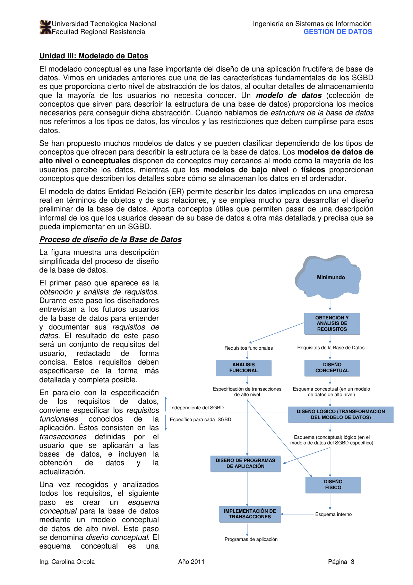

El primer paso es la **obtención y análisis de requisitos**. Durante este paso los diseñadores
entrevistan a los futuros usuarios de la base de datos para entender y documentar sus requisitos de
datos. El resultado es un conjunto de requisitos del usuario redactado de forma concisa. Estos
requisitos deben especificarse de la forma más detallada y completa posible.

En paralelo con la especificación de los requisitos de datos, conviene especificar los **requisitos
funcionales** de la aplicación. Éstos consisten en las transacciones definidas por el usuario que se
aplicarán a las bases de datos, e incluyen la obtención de datos y la actualización.

Una vez recogidos y analizados todos los requisitos, el siguiente paso es crear un **esquema
conceptual** para la base de datos mediante un modelo conceptual de datos de alto nivel. Este paso
se denomina **diseño conceptual**. El esquema conceptual es una descripción concisa de los
requisitos de información de los usuarios, y contiene descripciones detalladas de los tipos de
entidad, vínculos y restricciones representados según el modelo conceptual de datos usado. Puesto
que estos conceptos no incluyen detalles de implementación, suelen ser fáciles de entender y pueden
servir para comunicarse con usuarios no técnicos.

A partir de allí se debe usar un SGBD para implementar la base de datos. Esto se logra transformando
el esquema conceptual del modelo usado al modelo de datos de implementación. Este paso se llama
**diseño lógico** o **transformación del modelo de datos**, y su resultado es un esquema de la base
de datos en el modelo de datos que se usará para la implementación.

El paso final es la fase de **diseño físico**, durante la cual se especifican las estructuras de
almacenamiento internas, los caminos de acceso y la organización de ficheros de la base de datos. En
paralelo con estas actividades, se diseñan e implementan programas de aplicación en forma de
transacciones de la base de datos.

---

## Diseño de base de datos y diagramas ER

El proceso de diseño de base de datos puede dividirse en seis etapas, de las cuales el Modelo ER es
muy relevante para los tres primeros pasos:

1. **Análisis de Requisitos.** Comprender los datos que se deben guardar en la base de datos, las
   aplicaciones que se deben construir sobre ellos y las operaciones que son más frecuentes e
   imponen requisitos de rendimiento.

2. **Diseño conceptual de base de datos.** La información reunida en el análisis de requerimientos
   se emplea para desarrollar una descripción de alto nivel de los datos que se van a guardar en la
   base de datos, junto con las restricciones que se sabe que se impondrán sobre esos datos. Este
   paso se suele llevar a cabo empleando el modelo ER.

3. **Diseño lógico de la base de datos.** Hay que escoger un SGBD que implemente nuestro diseño de
   la base de datos y transformar el diseño conceptual en un esquema del modelo de datos del SGBD
   elegido. Para nosotros, la transformación será de ER a Relacional.

4. **Refinamiento de los esquemas:** análisis del conjunto de relaciones del esquema relacional para
   identificar posibles problemas y refinarlo. Este paso puede guiarse por la teoría de la
   normalización de relaciones.

5. **Diseño físico de la base de datos:** se toman en consideración las cargas de trabajo típicas
   esperadas que deberá soportar la base de datos y se refinará aún más el diseño para garantizar
   que cumpla con los criterios de rendimiento deseados.

6. **Diseño de aplicaciones y de la seguridad:** identificar las entidades y los procesos
   relacionados con la aplicación, describir el papel de cada entidad en cada proceso, e identificar
   las partes de la base de datos que debe tener accesibles cada entidad.

---

## Entidades, atributos y conjuntos de entidades

Una **entidad** es un objeto del mundo real que puede distinguirse de otros objetos. Puede ser un
objeto con existencia física (una persona, un automóvil, un empleado) o un objeto con existencia
conceptual (una empresa, un puesto de trabajo, un curso universitario).

Cada entidad tiene propiedades específicas llamadas **atributos** que la describen. En el modelo ER
se manejan distintos tipos de atributos:

- **Atributos compuestos o simples:** los compuestos se pueden dividir en componentes más pequeños
  (ej.: Dirección → Calle, Número, Piso); los simples no son divisibles.
- **Atributos monovaluados o multivaluados:** los monovaluados tienen un único valor por entidad
  (ej.: Edad); los multivaluados pueden tener un conjunto de valores (ej.: Título de la entidad
  Persona).
- **Atributos almacenados o derivados:** el atributo Fecha de Nacimiento es almacenado, pero Edad es
  derivado (se calcula según la fecha actual cada vez que se consulta la entidad).

Resulta útil identificar conjuntos de entidades similares (**conjunto de entidades**). Estas
entidades comparten los mismos atributos. Cada atributo está asociado a un **dominio** de valores
posibles.

Además, para cada conjunto de entidades se escoge una **clave**: un conjunto mínimo de atributos
cuyos valores identifican de manera unívoca a cada entidad del conjunto. Puede haber más de una
clave candidata; en ese caso, se escoge una como **clave principal**.

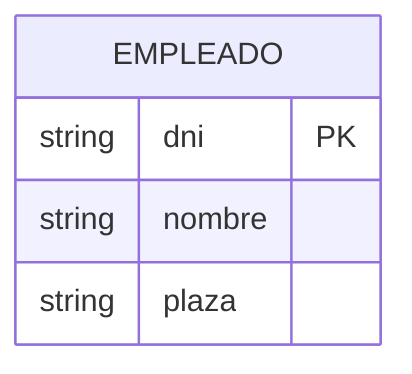

---

## Las relaciones y los conjuntos de relaciones

Una **relación** es una asociación entre dos o más entidades. Se puede considerar a los conjuntos de
relaciones como conjuntos de n-tuplas:

> { (e₁, …, eₙ) | e₁ ∈ E₁, …, eₙ ∈ Eₙ }

Cada n-tupla denota una relación que implica a n entidades, donde la entidad eᵢ se halla en el
conjunto de entidades Eᵢ.

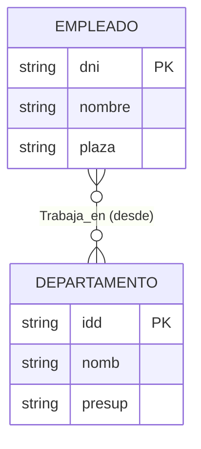

Las **relaciones también pueden tener atributos descriptivos**, empleados para registrar información
sobre la relación (no sobre las entidades participantes). Por ejemplo, el atributo `desde` en
Trabaja_en registra la fecha en que el empleado comenzó a trabajar en ese departamento.

Cada relación debe identificarse de manera unívoca por sus entidades participantes, sin necesidad de
referencia alguna a los atributos descriptivos.

El siguiente diagrama muestra un **ejemplar del conjunto de relaciones Trabaja_en**, donde la
participación de ambos conjuntos es total:

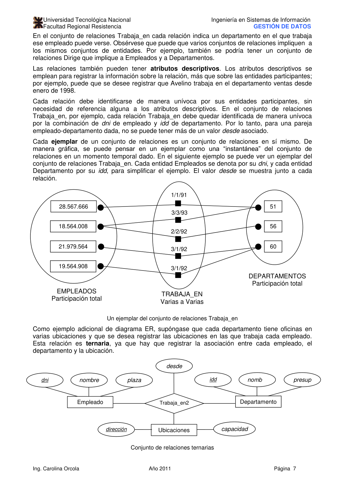

Como ejemplo adicional, cuando cada departamento tiene oficinas en varias ubicaciones y se desea
registrar las ubicaciones en las que trabaja cada empleado, la relación es **ternaria**:

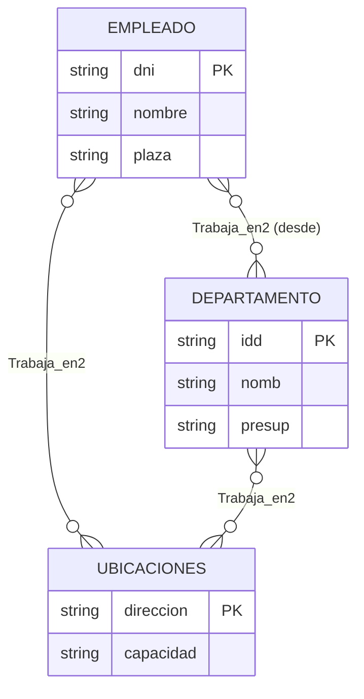

Cuando un conjunto de entidades desempeña más de un papel en una relación (ej.: Informa_a entre
empleados), se usan **indicadores de roles**:

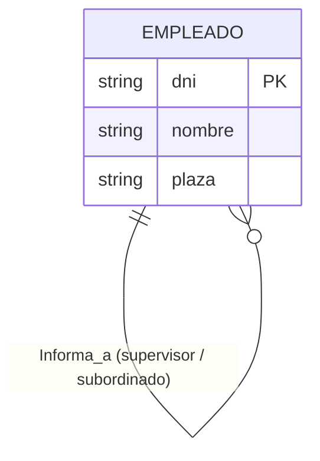

---

## Otras características del modelo ER

### Restricciones de clave en relaciones

Considerando el conjunto de relaciones **Dirige** entre Empleados y Departamentos, con la
restricción de que cada departamento tiene como máximo un encargado (aunque un empleado puede
dirigir más de un departamento): esta es una **restricción de clave**, indicada en el diagrama ER
mediante una flecha de Departamento a Dirige.

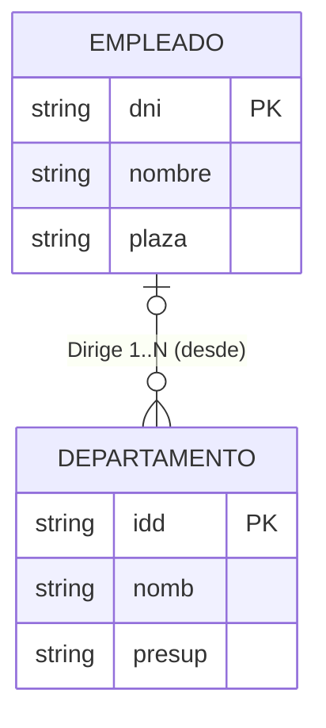

Se dice que este conjunto de relaciones es **de una a varias (1…N)**. El conjunto Trabaja_en, en el
que cada empleado puede trabajar en varios departamentos y cada departamento puede tener varios
empleados, es **de varias a varias (N…N)**. Si se añade la restricción de que cada empleado puede
dirigir como máximo un departamento, se tendría una relación **de una a una (1…1)**.

### Restricciones de clave en relaciones ternarias

Si el conjunto de entidades E tiene una restricción de clave en el conjunto de relaciones R, cada
entidad de un ejemplar concreto de E aparecerá, como máximo, en una relación de R. Por ejemplo, si
cada empleado trabaja como máximo en un departamento y en una única ubicación:

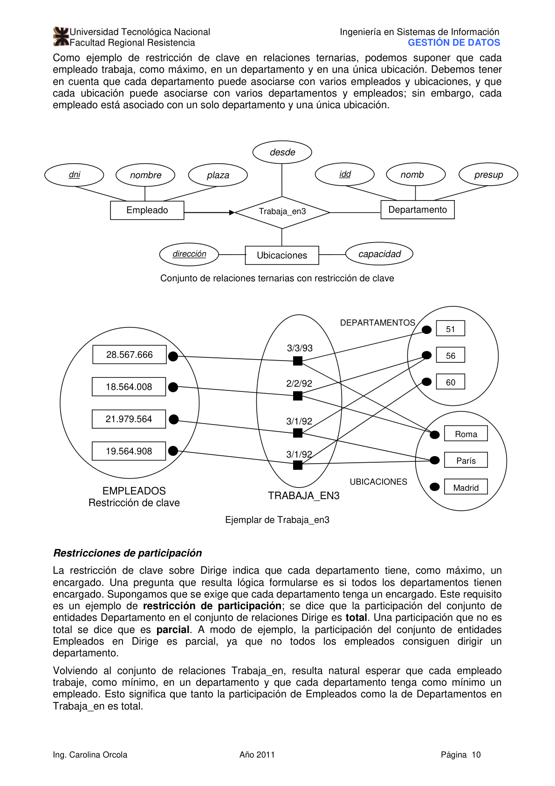

### Restricciones de participación

La **restricción de participación** determina si todos los elementos de un conjunto de entidades
participan en una relación:

- **Participación total:** todas las entidades del conjunto participan en al menos una relación (se
  indica con línea gruesa).
- **Participación parcial:** algunas entidades pueden no participar.

Por ejemplo, la participación de Departamentos en Dirige es **total** (todo departamento tiene un
encargado), mientras que la participación de Empleados en Dirige es **parcial** (no todos los
empleados dirigen un departamento).

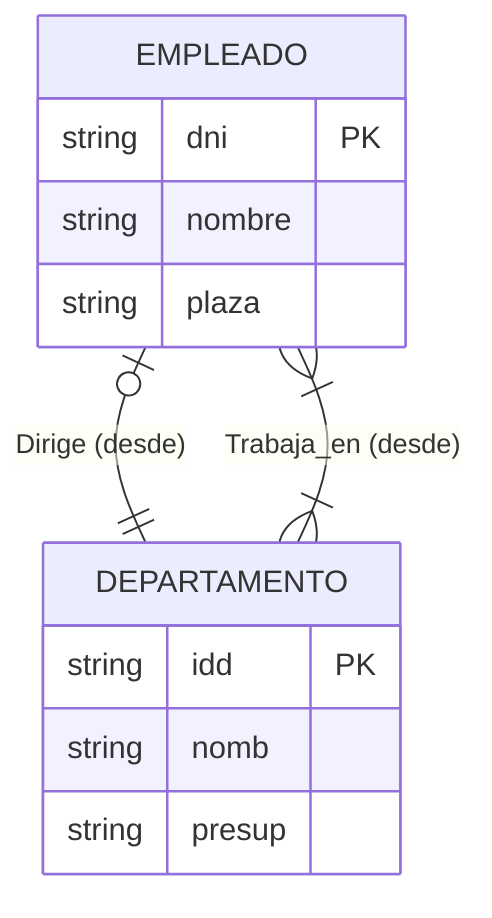

### Entidades débiles

Un **conjunto de entidades débiles** es aquel cuyos atributos no permiten identificar de manera
unívoca a sus entidades sin tomar en consideración la clave principal de otra entidad (**propietaria
identificadora**).

Restricciones que deben cumplirse:

- El conjunto propietario y el débil deben participar en una relación **de uno a varias** (cada
  propietaria se asocia con una o varias entidades débiles, pero cada entidad débil solo tiene una
  propietaria). Este conjunto se denomina **conjunto de relaciones identificadoras**.
- El conjunto de entidades débiles debe tener **participación total** en el conjunto de relaciones
  identificadoras.

El conjunto de atributos de un conjunto de entidades débiles que identifica de manera unívoca a una
entidad débil para una entidad propietaria dada se denomina **clave parcial** (subrayada con línea
punteada en el diagrama).

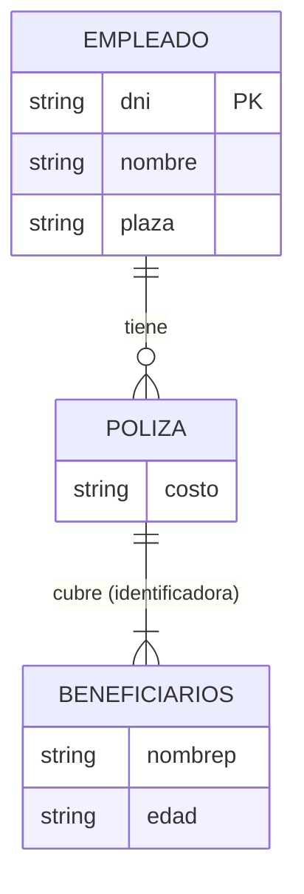

### Jerarquías de clases

A veces resulta natural clasificar las entidades en un conjunto de entidades en **subclases**. Por
ejemplo, `Empleados_temp` y `Empleados_fijos` son subclases de `Empleados`. Todos los atributos de
`Empleados` se **heredan** por los conjuntos de entidades derivados.

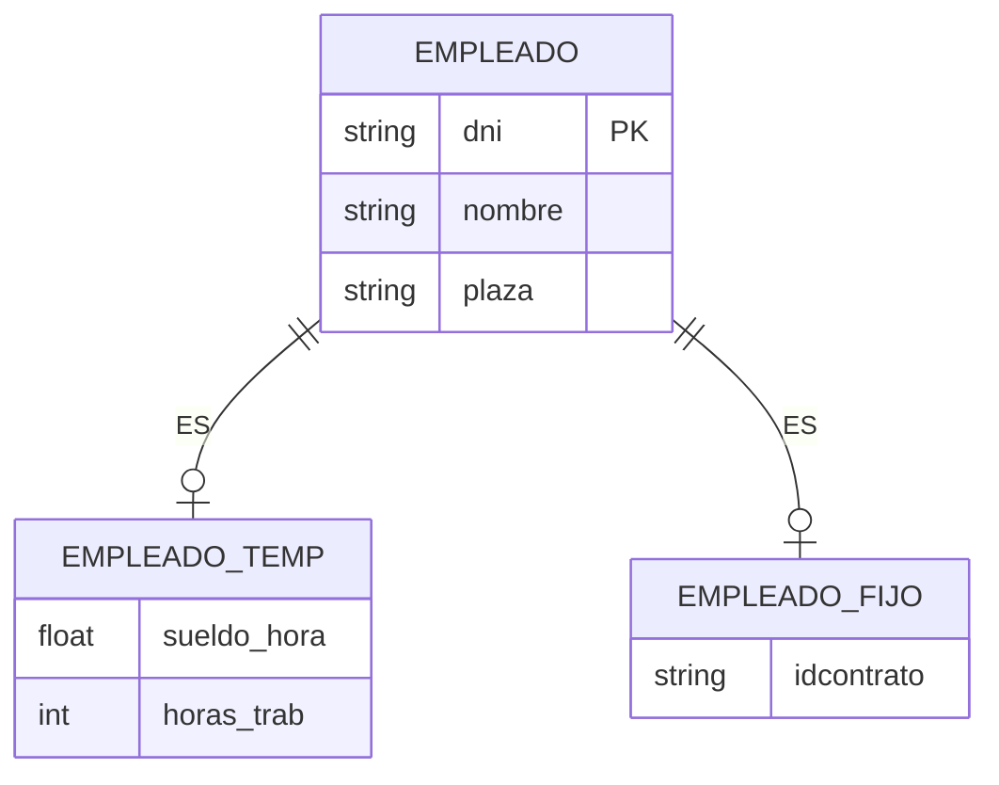

Las jerarquías de clases se pueden considerar desde dos puntos de vista:

- **Especialización:** `Empleados` está especializado en subclases. La superclase se define primero,
  luego las subclases con sus atributos específicos.
- **Generalización:** `Empleados_temp` y `Empleados_fijos` se generalizan en `Empleados`. Las
  subclases se definen primero, luego la superclase.

Se pueden especificar dos tipos de restricciones:

- **Restricciones de solapamiento:** determinan si se permite que dos clases contengan la misma
  entidad (ej.: un empleado puede ser tanto `Empleados_fijos` como `Empleados_veteranos` → se denota
  "SOLAPA A").
- **Restricciones de cobertura:** determinan si las entidades de las subclases incluyen de manera
  colectiva a todas las entidades de la superclase (ej.: "Motos Y Coches CUBREN
  Vehículos_motorizados").

### Agregación

La **agregación** permite indicar que un conjunto de relaciones (identificado mediante un cuadro
discontinuo) participa en otro conjunto de relaciones. Se usa cuando hace falta expresar una
relación entre relaciones.

Por ejemplo, si cada proyecto es financiado por uno o varios departamentos (relación Financia), y el
departamento que financia un proyecto puede asignar empleados para que lo controlen (relación
Controla), Controla debería asociar relaciones de Financia con entidades de Empleados. Esto se
modela mediante agregación:

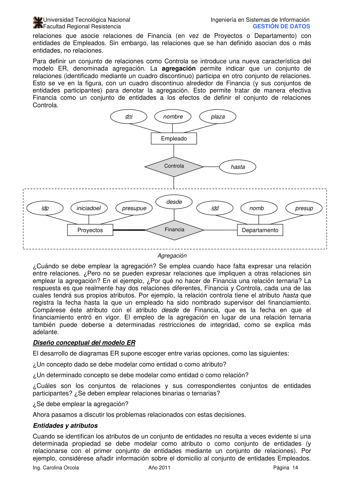

¿Cuándo emplear la agregación en lugar de una relación ternaria? Cuando existen **dos relaciones
diferentes** con sus propios atributos (en el ejemplo, `hasta` de Controla vs. `desde` de Financia),
o cuando se quieren expresar restricciones de integridad que no pueden expresarse con una relación
ternaria.

---

## Diseño conceptual del modelo ER

El desarrollo de diagramas ER supone escoger entre varias opciones:

- ¿Un concepto dado se debe modelar como entidad o como atributo?
- ¿Un determinado concepto se debe modelar como entidad o como relación?
- ¿Se deben emplear relaciones binarias o ternarias?
- ¿Se debe emplear la agregación?

### Entidades y atributos

Cuando se identifican los atributos de un conjunto de entidades no resulta a veces evidente si una
determinada propiedad se debe modelar como atributo o como conjunto de entidades. Por ejemplo, para
añadir información sobre el domicilio al conjunto Empleados:

- **Como atributo:** resulta adecuado si solo hace falta registrar un domicilio por empleado y basta
  con pensar en el domicilio como una cadena de caracteres.
- **Como entidad Domicilios** (con relación Tiene_domicilio): necesario cuando hay que registrar más
  de una dirección por empleado, o cuando se desea capturar la estructura del domicilio (ciudad,
  provincia, país, código postal) para soportar consultas como "Buscar todos los empleados con
  domicilio en Madrid".

Otro caso: si cada empleado puede trabajar en un departamento dado en **más de un período**, no se
puede usar un atributo `desde`/`hasta` en la relación (cada relación se identifica únicamente por
sus entidades participantes). La solución es introducir un conjunto de entidades `Duración` con
atributos `desde` y `hasta`:

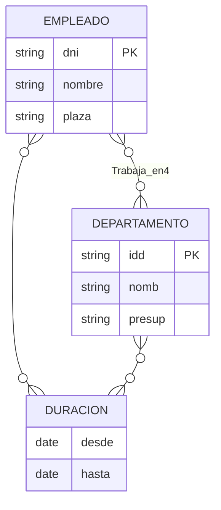

### Entidades y relaciones

Si el presupuesto discrecional es una suma que abarca a todos los departamentos dirigidos por un
empleado, asociarlo como atributo de la relación Dirige llevaría a **almacenamiento redundante**. La
solución es introducir un nuevo conjunto de entidades `Encargados` (como subclase de Empleados):

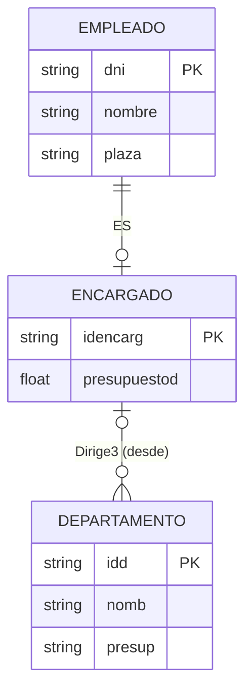

### Relaciones binarias y ternarias

Hay situaciones en que intentar emplear una sola relación ternaria resulta inadecuado y es mejor
usar dos relaciones binarias. Por ejemplo, si se tienen los requisitos de que dos empleados no
pueden poseer conjuntamente una póliza, y cada póliza debe ser propiedad de algún empleado:

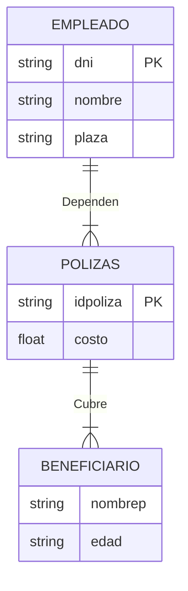

Hay situaciones, no obstante, en las que una relación asocia de manera inherente a más de dos
entidades. Como ejemplo típico de relación ternaria: los conjuntos Repuestos, Proveedores y
Departamentos, y el conjunto de relaciones Contratos (con el atributo `cant`). Un contrato
especifica que un determinado proveedor suministrará una cierta cantidad de un repuesto concreto a
un cierto departamento. Esta relación no puede capturarse de manera adecuada mediante relaciones
binarias, por dos razones:

- El hecho de que el proveedor P pueda suministrar el repuesto R, que D necesite R, y que D compre a
  P, no implica necesariamente que D compre realmente R a P.
- No se puede representar adecuadamente el atributo `cant` de los contratos.

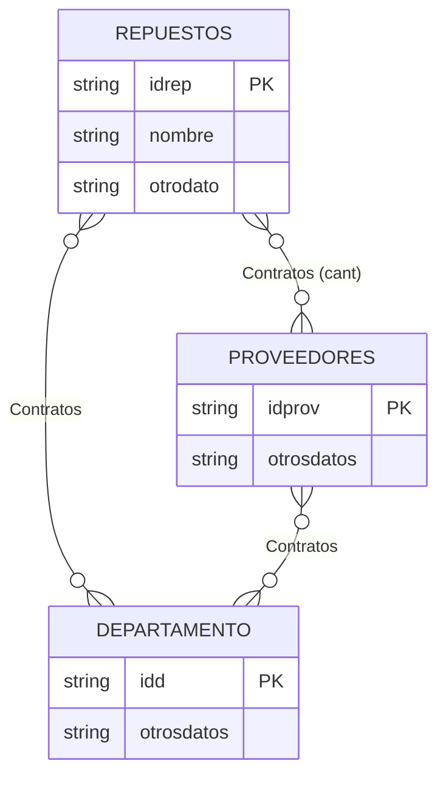

### Agregación y relaciones ternarias

La decisión de emplear la agregación o una relación ternaria viene determinada principalmente por la
existencia de una relación que vincule un conjunto de relaciones con un conjunto de entidades, o por
determinadas restricciones de integridad que se deseen expresar. Por ejemplo, si se quiere expresar
la restricción de que cada financiamiento (de un proyecto por un departamento) esté controlado como
máximo por un empleado, esa restricción **no puede expresarse** con una relación ternaria Financia2,
pero **sí puede expresarse** fácilmente con la agregación, trazando una flecha desde la relación
agregada Financia a la relación Controla.

---

## Resumen de símbolos

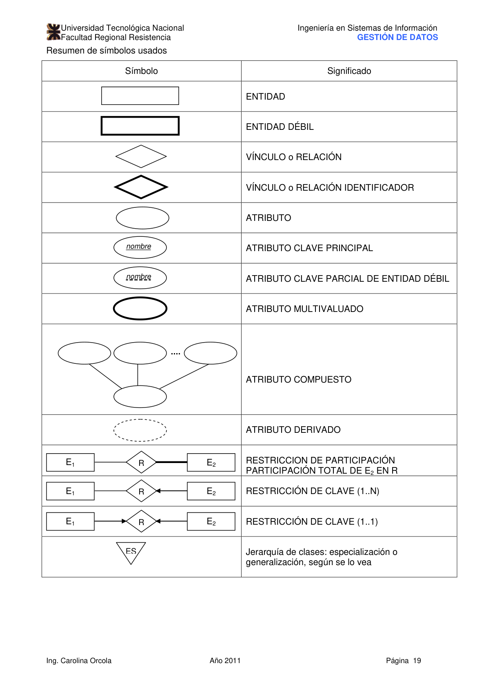

---

## Bibliografía

1. Ramakrishnan, R. y Gehrke, J. — _Sistema de Administración de Bases de Datos_, Mc Graw Hill, 3ª
   edición en español, 2007.
2. Elmasri y Navathe — _Fundamentos de Sistemas de Bases de Datos_, Addison Wesley, 3ª edición,
   Madrid, 2002.
3. Mendelzon y Ale — _Introducción a las bases de datos relacionales_, Prentice Hall, 1ª edición,
   Argentina, 2000.
4. Piattini, M. M. — _Concepto y diseño de bases de datos_, Addison-Wesley.
5. Korth, F. H. — _Fundamentos de base de datos_, McGraw Hill, 3ª edición, 1998.
6. Date, C. J. — _Introducción a los sistemas de base de datos_, Prentice-Hall, 7ª edición, 2001.
7. Elmasri y Navathe — _Sistemas de Bases de Datos – Conceptos fundamentales_, Addison Wesley, 2ª
   edición, Madrid, 1994.
