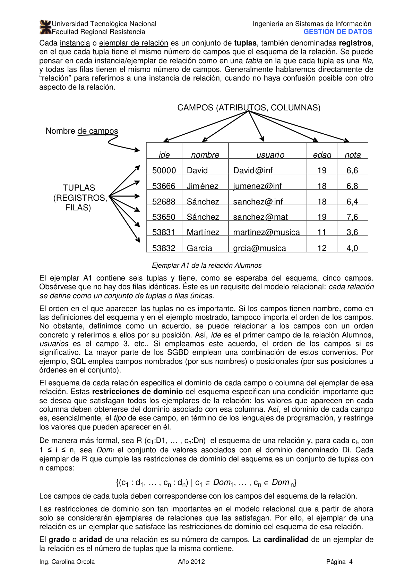
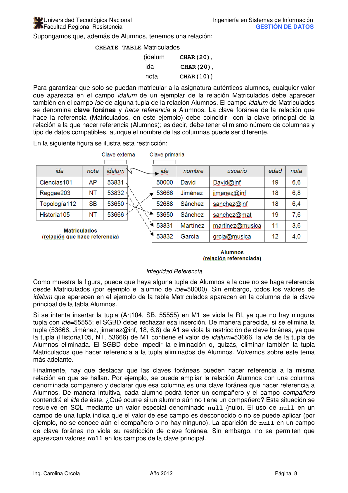
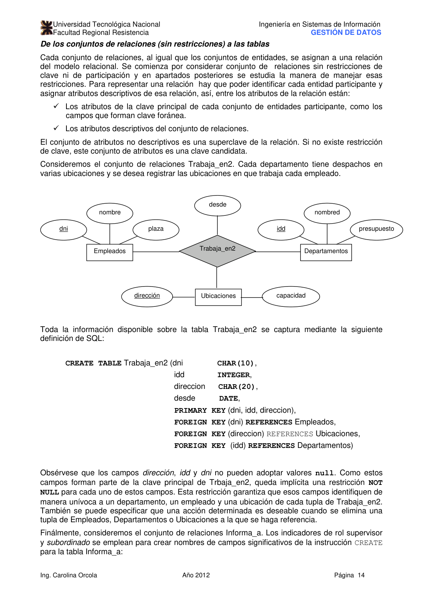
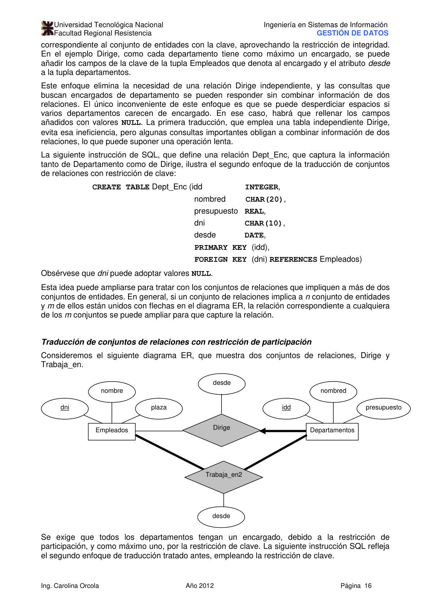
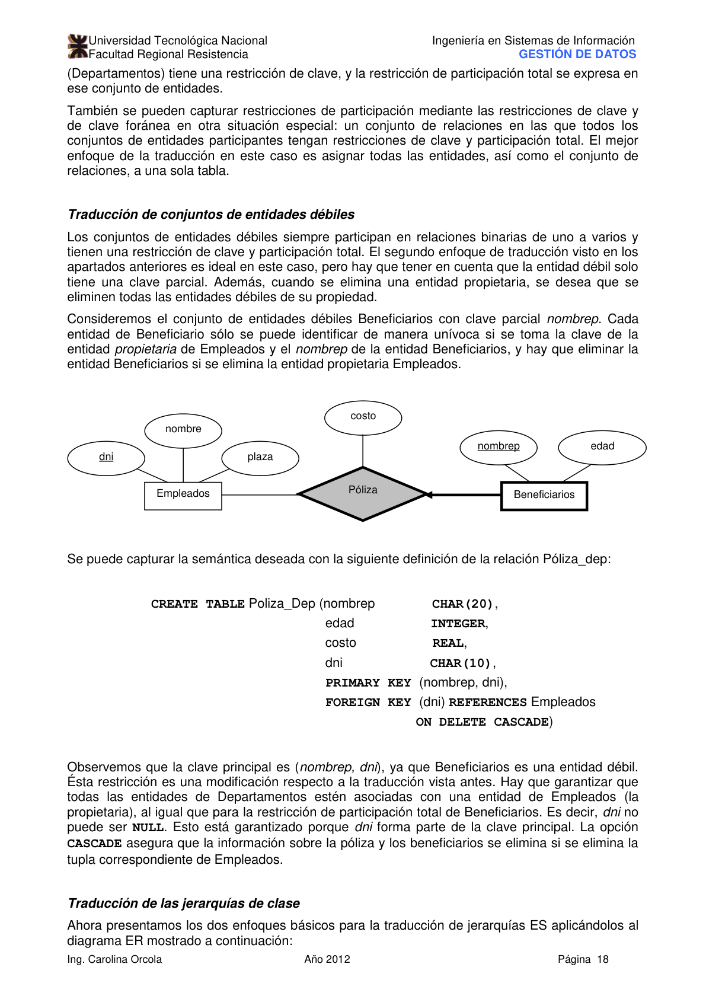
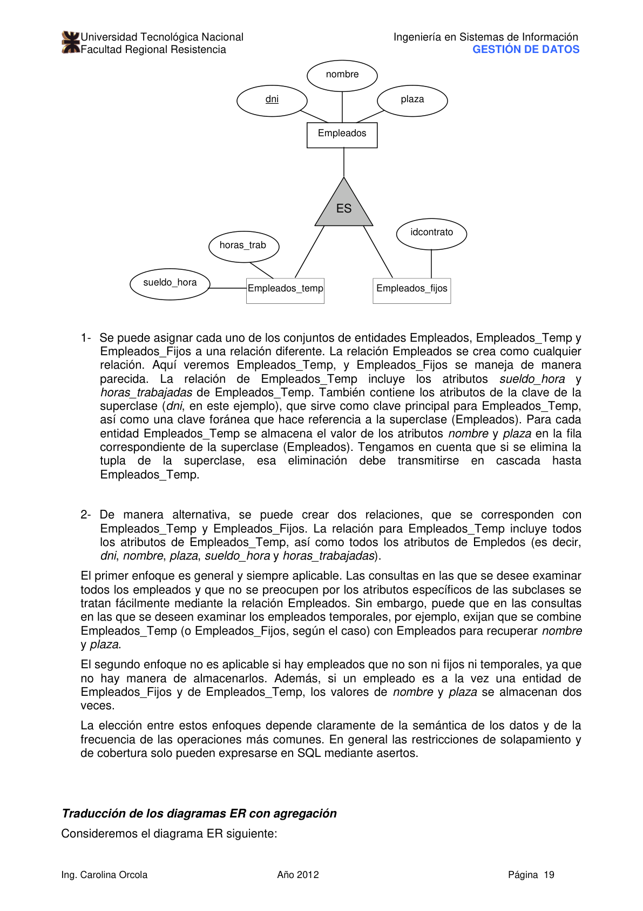
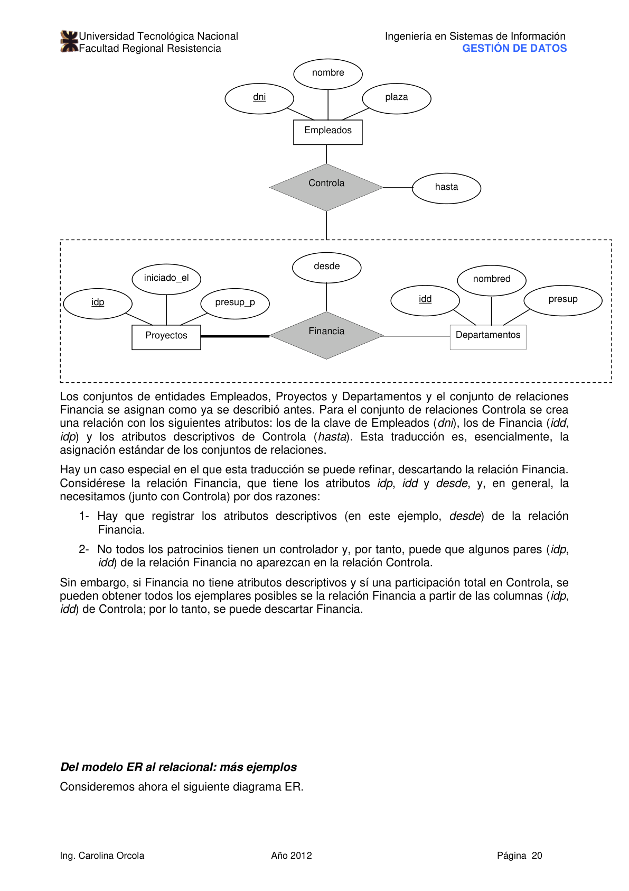
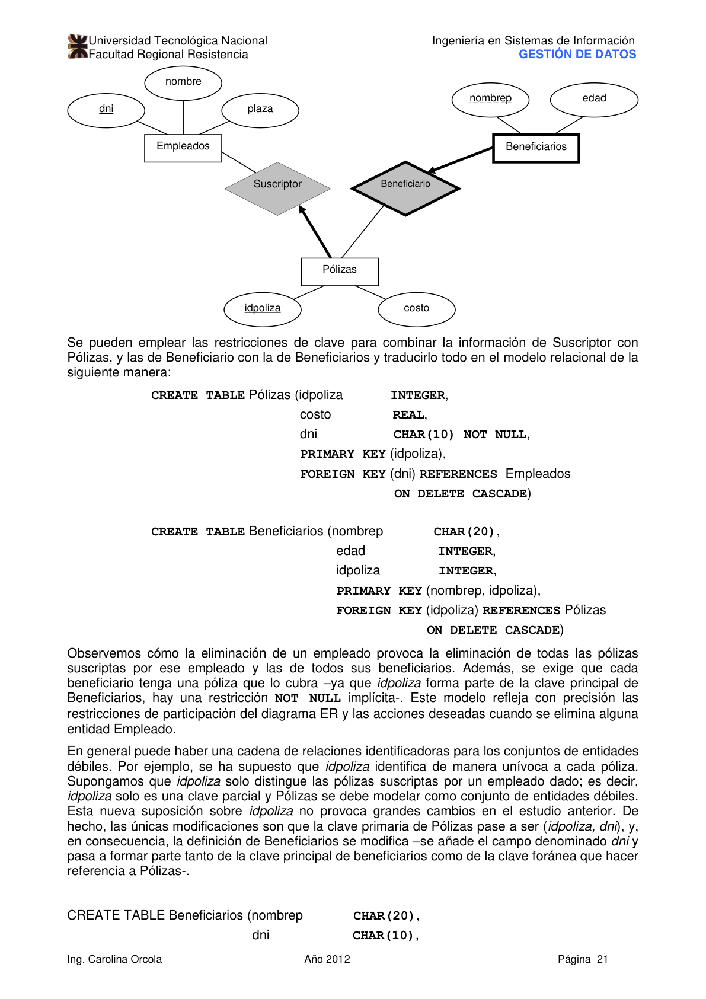

# Unidad IV: El Modelo Relacional

> **Gestión de Datos** — Ingeniería en Sistemas de Información, UTN-FRRE
>
> Profesora: Ing. Carolina Orcola
>
> Jefe de T.P.: Ing. Luis Eiman
>
> Auxiliar: Juan Carlos Fernández

---

## Índice

- [Unidad III: El Modelo Relacional](#unidad-iii-el-modelo-relacional)
  - [Introducción al Modelo Relacional](#introducción-al-modelo-relacional)
    - [Creación y modificación de relaciones mediante SQL](#creación-y-modificación-de-relaciones-mediante-sql)
  - [Restricciones de integridad sobre las relaciones](#restricciones-de-integridad-sobre-las-relaciones)
    - [Restricciones de clave](#restricciones-de-clave)
    - [Restricciones de clave foránea (externa)](#restricciones-de-clave-foránea-externa)
    - [Restricciones generales](#restricciones-generales)
  - [Cumplimiento de las restricciones de integridad](#cumplimiento-de-las-restricciones-de-integridad)
    - [Transacciones y restricciones](#transacciones-y-restricciones)
  - [Consultas de datos relacionales](#consultas-de-datos-relacionales)
  - [Diseño lógico: del Modelo ER al Modelo Relacional](#diseño-lógico-del-modelo-er-al-modelo-relacional)
    - [De los conjuntos de entidades a las tablas](#de-los-conjuntos-de-entidades-a-las-tablas)
    - [De los conjuntos de relaciones a las tablas](#de-los-conjuntos-de-relaciones-a-las-tablas)
    - [Traducción con restricción de clave](#traducción-con-restricción-de-clave)
    - [Traducción con restricción de participación](#traducción-con-restricción-de-participación)
    - [Traducción de entidades débiles](#traducción-de-entidades-débiles)
    - [Traducción de jerarquías de clase](#traducción-de-jerarquías-de-clase)
    - [Traducción de diagramas ER con agregación](#traducción-de-diagramas-er-con-agregación)
    - [Del modelo ER al relacional: más ejemplos](#del-modelo-er-al-relacional-más-ejemplos)
  - [SGBD Relacionales Comerciales](#sgbd-relacionales-comerciales)
  - [SGBD Relacionales Open Source](#sgbd-relacionales-open-source)
  - [SQL](#sql)
  - [Bibliografía](#bibliografía)

---

## Introducción al Modelo Relacional

El modelo relacional, introducido por E.F. Codd a principios de la década del 70, fue el primer modelo de datos en describir información en términos de tablas simples. Se basa en los productos de todas las empresas líderes de bases de datos, como Oracle e IBM, y sistemas de bases de datos de código abierto como MySQL y PostgreSQL.

La principal estructura de datos del modelo relacional son las **relaciones**. Una relación puede verse como un conjunto de registros. Un campo de datos, también denominado **atributo**, es una columna en una tabla con nombre y tipo. Una **tupla** es básicamente una fila en la tabla. Cada registro/fila en el conjunto de datos es una instancia de la relación.

Un **esquema** de una relación especifica el nombre de la tabla y los tipos de sus campos. Ejemplo:

```text
Alumnos (nombre: string, edad: integer, nota: real)
```

Una **instancia** de una relación es el conjunto de tuplas en la relación. Cada instancia/ejemplo de la relación es una tabla donde el número de campos es igual al número de atributos del esquema y el número de filas es el número de tuplas.



El **grado** (o aridad) de una relación es el número de campos. La **cardinalidad** de una instancia de la relación es el número de tuplas que contiene.

### Creación y modificación de relaciones mediante SQL

El subconjunto de SQL que se emplea para la creación, eliminación y modificación de tablas se denomina lenguaje de definición de datos (LDD). La instrucción `CREATE TABLE` se emplea para crear una nueva relación:

```sql
CREATE TABLE Alumnos (
    nombre  CHAR(30),
    edad    INTEGER,
    nota    REAL
);
```

Observar que se especifica el tipo (dominio) de cada fila y, que esto, el DBMS impone el tipo al momento de insertar datos. El campo `nota` puede tener valores nulos (NULL). Por omisión, todos los campos pueden tener valores NULL, salvo que se especifique la restricción `NOT NULL`. Se puede borrar una tabla completa usando `DROP TABLE Alumnos`.

Se puede modificar la estructura de una tabla usando `ALTER TABLE`. Por ejemplo, para agregar la columna salario a la tabla Alumnos:

```sql
ALTER TABLE Alumnos ADD COLUMN salario INTEGER;
```

Las tuplas se insertan en la tabla con `INSERT`:

```sql
INSERT INTO Alumnos (nombre, edad, nota)
VALUES ('Sanchez', 18, 3.8);
```

Se pueden eliminar tuplas que satisfagan una condición con `DELETE`:

```sql
DELETE FROM Alumnos
WHERE nombre = 'Sanchez';
```

---

## Restricciones de integridad sobre las relaciones

Una **restricción de integridad (RI)** es una condición especificada en un esquema de base de datos que restringe los datos que se pueden almacenar en una instancia de la base de datos. Si una BD está en un estado que satisface todas las RI especificadas en el esquema de la BD, se trata de un **estado legal** de la BD. El SGBD hace cumplir las restricciones de integridad.

### Restricciones de clave

Una **clave candidata** para una relación es un conjunto de campos que identifica unívocamente a una tupla. Ningún subconjunto propio de dicha clave candidata identifica también de manera unívoca a una tupla. Puede haber más de una clave candidata. Una de ellas se designa como **clave principal** (*primary key*).

**Especificación en SQL:**

```sql
CREATE TABLE Matriculados (
    nombre  CHAR(30),
    cid     CHAR(20),
    nota    CHAR(10),
    PRIMARY KEY (nombre, cid)
);
```

Si la clave principal es un solo campo, puede declararse en línea:

```sql
CREATE TABLE Alumnos (
    nombre  CHAR(30) PRIMARY KEY,
    edad    INTEGER,
    nota    REAL
);
```

### Restricciones de clave foránea (externa)

Una **clave foránea** (o externa) es un conjunto de campos de una relación que se utiliza para hacer referencia a una tupla en otra relación. Debe referirse a la clave principal de la otra relación.

Si todas las referencias a claves externas tienen sus correspondientes tuplas en la tabla referenciada, se dice que la BD es **referencialmente íntegra**.

Por ejemplo, considerando que Alumnos(nombre) es la clave principal de la tabla Alumnos, y Matriculados tiene un campo `nombre` que referencia a Alumnos:

```sql
CREATE TABLE Matriculados (
    nombre  CHAR(30),
    cid     CHAR(20),
    nota    CHAR(10),
    PRIMARY KEY (nombre, cid),
    FOREIGN KEY (nombre) REFERENCES Alumnos
);
```



Si se intenta insertar una tupla en Matriculados cuyo `nombre` no exista en Alumnos, el SGBD rechaza la inserción. Del mismo modo, si se intenta borrar una tupla de Alumnos cuyo `nombre` aparece en Matriculados, el SGBD tiene varias opciones según la política de borrado:

- **NO ACTION / RESTRICT** (por defecto): rechaza el borrado.
- **CASCADE**: borra también las tuplas que hacen referencia.
- **SET NULL**: pone a NULL el campo de referencia en las tuplas afectadas.

**Especificación en SQL:**

```sql
CREATE TABLE Matriculados (
    nombre  CHAR(30),
    cid     CHAR(20),
    nota    CHAR(10),
    PRIMARY KEY (nombre, cid),
    FOREIGN KEY (nombre) REFERENCES Alumnos
        ON DELETE CASCADE
        ON UPDATE NO ACTION
);
```

### Restricciones generales

Las restricciones generales se especifican con `CHECK`:

```sql
CREATE TABLE Alumnos (
    nombre  CHAR(30),
    edad    INTEGER,
    nota    REAL,
    CHECK (edad >= 16 AND edad <= 99)
);
```

---

## Cumplimiento de las restricciones de integridad

El SGBD hace cumplir las RI en el momento de actualización de la BD (INSERT, DELETE, UPDATE). Si alguna actualización viola una RI, el SGBD puede rechazar el comando o ejecutar pasos adicionales compensatorios para garantizar el cumplimiento de las RI.

Las restricciones de clave se verifican siempre que se inserta o modifica una tupla. Las restricciones de clave foránea se verifican en inserciones, borrados y actualizaciones de tuplas en cualquiera de las tablas participantes.

### Transacciones y restricciones

En ocasiones puede desearse insertar dos tuplas que hacen referencia mutua (ej.: dos empleados donde cada uno es supervisor del otro). En este caso la RI se viola temporalmente al insertar la primera. SQL permite diferir las verificaciones de RI hasta el final de una transacción:

```sql
SET CONSTRAINTS nombre_restriccion DEFERRED;
```

---

## Consultas de datos relacionales

SQL es el lenguaje de consulta más popular para los SGBD relacionales. Siempre existe un símbolo `*` que denota todos los campos del conjunto de datos. La condición `A = 'Miguel'` es un predicado básico. El símbolo `%` en la condición `LIKE` denota cualquier cadena:

```sql
SELECT *
FROM   Alumnos A
WHERE  A.edad = 18;
```

```sql
SELECT A.nombre, e.salario
FROM   Alumnos A, INNER_JOIN Empleados e
WHERE  A.nombre = 'Miguel' AND A.nombre LIKE '%iguel';
```

---

## Diseño lógico: del Modelo ER al Modelo Relacional

### De los conjuntos de entidades a las tablas

Cada conjunto de entidades se convierte en una relación (tabla). Los atributos del conjunto de entidades se convierten en columnas de la tabla. La clave principal del conjunto de entidades se convierte en la clave principal de la tabla.

Ejemplo para el conjunto de entidades Empleados:

```sql
CREATE TABLE Empleados (
    dni     CHAR(11),
    nombre  CHAR(30),
    plaza   CHAR(20),
    PRIMARY KEY (dni)
);
```



### De los conjuntos de relaciones a las tablas

Cada conjunto de relaciones se mapea a una tabla. Los campos de esta tabla incluyen:

- Las claves principales de todos los conjuntos de entidades participantes (como claves foráneas).
- Los atributos descriptivos del conjunto de relaciones.

La clave principal de la tabla de relaciones es la combinación de las claves principales de todas las entidades participantes (salvo que haya restricciones de clave).

```sql
CREATE TABLE Trabaja_en (
    dni         CHAR(11),
    idd         CHAR(20),
    desde       DATE,
    PRIMARY KEY (dni, idd),
    FOREIGN KEY (dni)  REFERENCES Empleados,
    FOREIGN KEY (idd)  REFERENCES Departamentos
);
```

### Traducción con restricción de clave

Cuando existe una restricción de clave (relación 1:N), la clave principal de la tabla de relaciones puede reducirse. En el conjunto de relaciones Dirige (donde cada departamento tiene como máximo un encargado), la clave principal de Dirige puede ser solo `idd`:

```sql
CREATE TABLE Dirige (
    dni     CHAR(11),
    idd     CHAR(20),
    desde   DATE,
    PRIMARY KEY (idd),
    FOREIGN KEY (dni)  REFERENCES Empleados,
    FOREIGN KEY (idd)  REFERENCES Departamentos
);
```



Una alternativa más eficiente es incorporar la información de la relación en la tabla del conjunto de entidades que tiene la flecha (el "lado uno"):

```sql
CREATE TABLE Departamentos (
    idd         CHAR(20),
    nombred     CHAR(30),
    presup      REAL,
    dni_jefe    CHAR(11),
    desde       DATE,
    PRIMARY KEY (idd),
    FOREIGN KEY (dni_jefe) REFERENCES Empleados
);
```

### Traducción con restricción de participación

Si la participación es **total** (todas las entidades deben participar en la relación), se puede agregar la restricción `NOT NULL` al campo de clave foránea incorporado. Por ejemplo, si todo departamento debe tener un jefe:

```sql
CREATE TABLE Departamentos (
    idd         CHAR(20),
    nombred     CHAR(30),
    presup      REAL,
    dni_jefe    CHAR(11) NOT NULL,
    desde       DATE,
    PRIMARY KEY (idd),
    FOREIGN KEY (dni_jefe) REFERENCES Empleados
        ON DELETE NO ACTION
);
```

### Traducción de entidades débiles

Un conjunto de entidades débiles se convierte en una tabla que incluye:

- Sus propios atributos (incluyendo la clave parcial).
- La clave principal de la entidad propietaria (como clave foránea).
- La clave principal resultante es la combinación de ambas.
- La restricción de la relación identificadora se mapea con `ON DELETE CASCADE`.



```sql
CREATE TABLE Polizas (
    idpoliza    INTEGER,
    costo       REAL,
    dni         CHAR(11) NOT NULL,
    PRIMARY KEY (idpoliza),
    FOREIGN KEY (dni) REFERENCES Empleados
        ON DELETE CASCADE
);

CREATE TABLE Beneficiarios (
    nombrep     CHAR(30),
    edad        INTEGER,
    idpoliza    INTEGER NOT NULL,
    PRIMARY KEY (nombrep, idpoliza),
    FOREIGN KEY (idpoliza) REFERENCES Polizas
        ON DELETE CASCADE
);
```

### Traducción de jerarquías de clase



Hay dos enfoques principales para traducir jerarquías ES al modelo relacional:

1. **Una tabla por jerarquía:** una única tabla con todos los atributos de todas las subclases, más un campo `tipo` que indica la subclase. Las columnas no aplicables tendrán valor NULL.

```sql
CREATE TABLE Empleados_jerarquia (
    dni             CHAR(11),
    nombre          CHAR(30),
    plaza           CHAR(20),
    tipo            CHAR(20),
    sueldo_hora     REAL,
    horas_trab      INTEGER,
    idcontrato      CHAR(20),
    PRIMARY KEY (dni)
);
```

1. **Una tabla por subclase:** una tabla para la superclase y tablas separadas para cada subclase, con la clave principal de la superclase como clave foránea.

```sql
CREATE TABLE Empleados (
    dni     CHAR(11),
    nombre  CHAR(30),
    plaza   CHAR(20),
    PRIMARY KEY (dni)
);

CREATE TABLE Empleados_temp (
    dni         CHAR(11),
    sueldo_hora REAL,
    horas_trab  INTEGER,
    PRIMARY KEY (dni),
    FOREIGN KEY (dni) REFERENCES Empleados
);

CREATE TABLE Empleados_fijos (
    dni         CHAR(11),
    idcontrato  CHAR(20),
    PRIMARY KEY (dni),
    FOREIGN KEY (dni) REFERENCES Empleados
);
```

### Traducción de diagramas ER con agregación



Los conjuntos de entidades Empleados, Proyectos y Departamentos y el conjunto de relaciones Financia se asignan como ya se describió antes. Para el conjunto de relaciones Controla se crea una relación con los atributos: clave de Empleados (*dni*), los de Financia (*idd*, *idp*) y los atributos descriptivos de Controla (*hasta*):

```sql
CREATE TABLE Controla (
    dni     CHAR(11),
    idp     CHAR(20),
    idd     CHAR(20),
    hasta   DATE,
    PRIMARY KEY (idp, idd),
    FOREIGN KEY (dni)       REFERENCES Empleados,
    FOREIGN KEY (idp, idd)  REFERENCES Financia
);
```

### Del modelo ER al relacional: más ejemplos



Considerando el diagrama, se pueden capturar las restricciones de clave y participación mediante las siguientes definiciones SQL. La clave principal de Pólizas refleja que cada póliza pertenece a un único empleado. La restricción `ON DELETE CASCADE` en Beneficiarios garantiza que al eliminar una póliza se eliminan también sus beneficiarios.

```sql
CREATE TABLE Polizas (
    idpoliza    INTEGER,
    costo       REAL,
    dni         CHAR(11) NOT NULL,
    PRIMARY KEY (idpoliza),
    FOREIGN KEY (dni) REFERENCES Empleados
        ON DELETE CASCADE
);

CREATE TABLE Beneficiarios (
    nombrep     CHAR(30),
    edad        INTEGER,
    idpoliza    INTEGER NOT NULL,
    PRIMARY KEY (nombrep, idpoliza),
    FOREIGN KEY (idpoliza) REFERENCES Polizas
        ON DELETE CASCADE
);
```

---

## SGBD Relacionales Comerciales

| SGBD | Descripción |
| ---- | ----------- |
| **Oracle** | Sistema de gestión de base de datos relacional, escalable y multiusuario con más de 40 años en el mercado. Muy usado en grandes empresas. Su mayor desventaja es su nivel de licenciamiento. |
| **Microsoft SQL Server** | Múltiples ediciones (incluyendo Express gratuita). Soporta procedimientos almacenados, vistas y potente interfaz gráfico de administración. Disponible en Sistemas Operativos Microsoft. |
| **IBM DB2** | Sistema de gestión de base de datos de IBM. Disponible en múltiples plataformas. Conocido por su robustez en entornos empresariales de gran escala. |

---

## SGBD Relacionales Open Source

| SGBD | Tipo | Descripción |
| ---- | ---- | ----------- |
| **MongoDB** | Documental | Base de datos Open Source de alto rendimiento, esquema-libre que usa documentos (pares JSON). Drivers preparados para lenguajes como Python, Ruby, JavaScript, C++. |
| **Hypertable** | Columnar | Sistema de almacenamiento distribuido de alto rendimiento diseñado para su uso en un clúster. Basado en el paper de Google BigTable. |
| **Apache CouchDB** | Documental | Base de datos orientada a documentos y multiplataforma. Destaca por su accesibilidad vía HTTP RESTful API. |
| **Neo4j** | Grafos | Motor de persistencia completamente compliant con ACID. Los datos se almacenan y consultan como grafos. Usa el lenguaje de consulta Cypher. |
| **Riak** | Clave-valor | Base de datos ideal para aplicaciones web que combina un valor clave descentralizado con un modelo de replicación basado en Dynamo de Amazon. |
| **Oracle Berkeley DB** | Embebida | Base de datos embebida que proporciona a los desarrolladores una forma simple y rápida de gestionar datos. Soporta propiedades ACID. |
| **Apache Cassandra** | Columnar | Base de datos distribuida altamente escalable. Usada por gigantes como Facebook, Twitter, Cisco y más. |
| **Memcached** | Clave-valor (memoria) | Almacén de tipo key-value para pequeñas cadenas de datos resultantes de llamadas a BD, API, etc. Muy usado para reducir la carga de la base de datos. |
| **Firebird** | Relacional | No confundir con Firefox. Base de datos relacional que puede ser utilizada en Linux, Windows y varias plataformas Unix. Soporta procedimientos almacenados, triggers y UDFs. |
| **Redis** | Clave-valor | Base de datos avanzada de tipo key-value escrita en C y que soporta strings, hashes, listas, sets y sets ordenados. |
| **HyperSQL (HSQLDB)** | Relacional (Java) | Motor de base de datos relacional escrito en Java. Ofrece un pequeño, rápido motor de base de datos multithreaded e interfaz gráfica para las consultas. |
| **MonetDB** | Columnar | Sistema de base de datos de código abierto para aplicaciones de alto rendimiento en OLAP, GIS, datamining y más. |
| **Persevere** | Documental | Motor de almacenamiento de objetos y de consultas que facilita el desarrollo rápido de aplicaciones orientadas a objetos en JavaScript. |
| **eXist-db** | XML | Base de datos XML nativa construida sobre tecnología XML. Se caracteriza por su procesamiento eficiente y basado en índices de XQuery. |
| **HBase** | Columnar | Distribución del proyecto Hadoop orientado a columnas, también denominado "miles de columnas". |
| **MariaDB** | Relacional | Fork compatible con MySQL, rama de desarrollo del proyecto MySQL Database Server. Incluye soporte del motor de almacenamiento Aria MAP / OLTP. |
| **Drizzle** | Relacional | Fork ligero de MySQL orientado a aplicaciones web y Cloud Computing. |
| **Scalien** | Clave-valor | Se trata de un sistema de base de datos con replicación que funciona y se escala a "miles de millones de columnas". Ofrece una gateway RESTful que soporta XML y JSON. |
| **4store** | RDF | Motor RDF eficiente, escalable y estático para almacenamiento y consultas. |

**Otras alternativas:** Gladius, CloudStore, OpenQM, ScarletDME, SmallSQL, LucidDB, HyperGraphDB, InfoGrid, Apache Derby, hamsterdb, H2 Database, EyeDB, txtSQL, db4o, Tokyo Cabinet, Project Voldemort.

---

## SQL

SQL (Structured Query Language) fue diseñado para interactuar con SGBD relacionales. El subconjunto de SQL que se usa para la definición de tablas se denomina LDD. El subconjunto de SQL que se usa para realizar consultas y actualizaciones se denomina LMD. SQL es un lenguaje de 4ª generación (4GL).

| Año | Nombre | Alias | Comentarios |
| --- | ------ | ----- | ----------- |
| 1986 | SQL-86 | SQL-87 | Primera publicación hecha por ANSI. Confirmada por ISO en 1987. |
| 1989 | SQL-89 | | Revisión menor. |
| 1992 | SQL-92 | SQL2 | Revisión mayor. |
| 1999 | SQL:1999 | SQL3 | Se agregan expresiones regulares, consultas recursivas, triggers, tipos no escalares y características básicas orientadas a objetos. |
| 2003 | SQL:2003 | | Introduce algunas características de XML, cambios en `WINDOW`, nuevos tipos de secuencia. |
| 2006 | SQL:2006 | | ISO/IEC 9075-14:2006 define las maneras en que SQL puede usarse conjuntamente con XML. Define maneras de importar y guardar datos XML en una BD SQL, manipulándolos dentro de la BD y publicándolos en forma XML y en forma de tablas SQL. Permite a las aplicaciones integrar el uso de XQuery. |
| 2008 | SQL:2008 | | Permite el uso de la cláusula `ORDER BY` fuera de las definiciones de cursores. Añade la instrucción `INSTEAD OF`, el tipo `TRUNCATE`. |

---

## Bibliografía

1. Ramakrishnan, R. y Gehrke, J. — *Sistema de Administración de Bases de Datos*, Mc Graw Hill, 3ª edición en español, 2007. *(La mayoría de los contenidos de este apunte son extraídos de este libro, con ejemplos y gráficos incluidos.)*
2. Elmasri y Navathe — *Fundamentos de Sistemas de Bases de Datos*, Addison Wesley, 3ª edición, Madrid, 2002.
3. Mendelzon y Ale — *Introducción a las bases de datos relacionales*, Prentice Hall, 1ª edición, Argentina, 2000.
4. Piattini, M. M. — *Concepto y diseño de bases de datos*, Addison-Wesley.
5. Korth, F. H. — *Fundamentos de base de datos*, McGraw Hill, 3ª edición, 1998.
6. Date, C. J. — *Introducción a los sistemas de base de datos*, Prentice-Hall, 7ª edición, 2001.
7. Elmasri y Navathe — *Sistemas de Bases de Datos – Conceptos fundamentales*, Addison Wesley, 2ª edición, Madrid, 1994.
