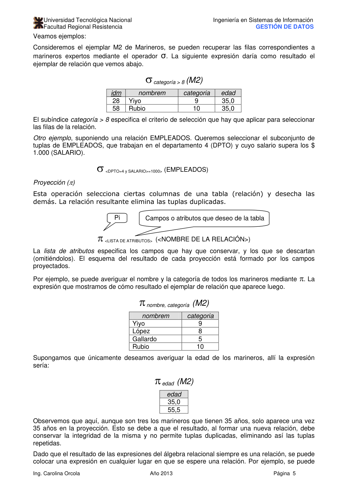
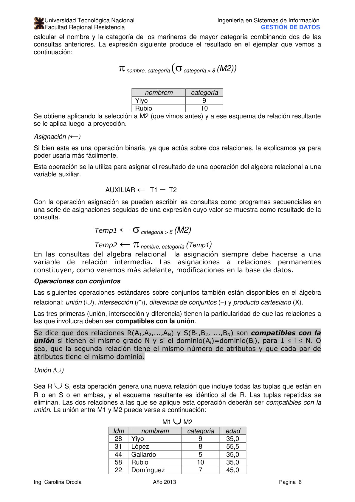
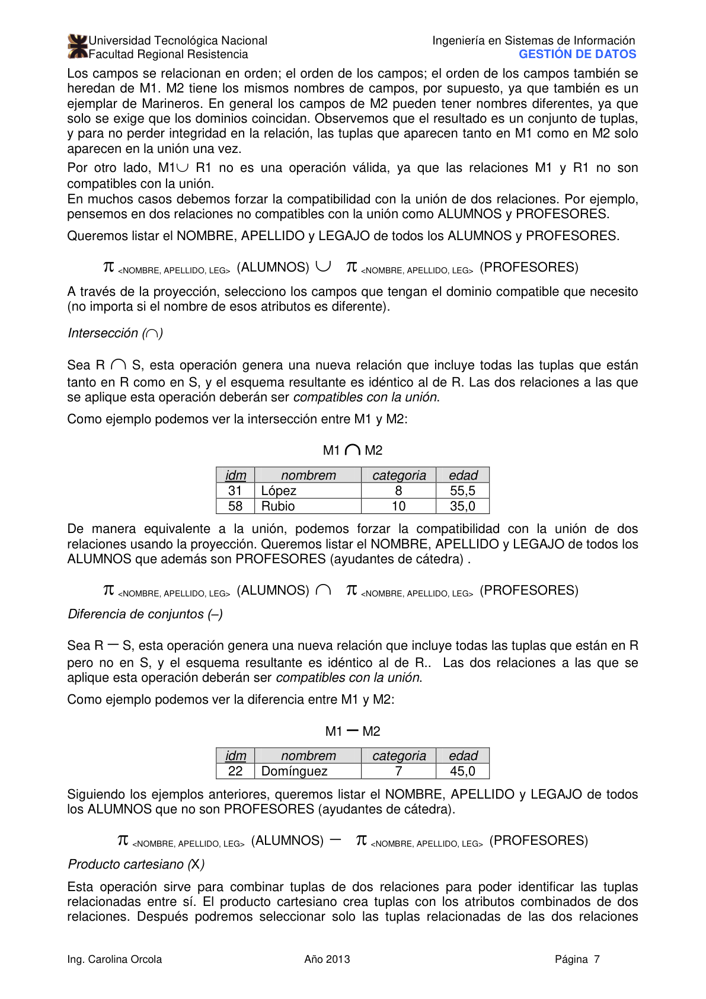
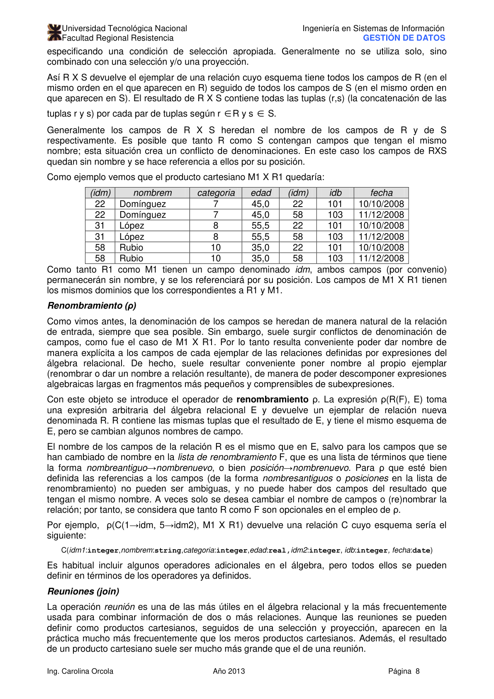
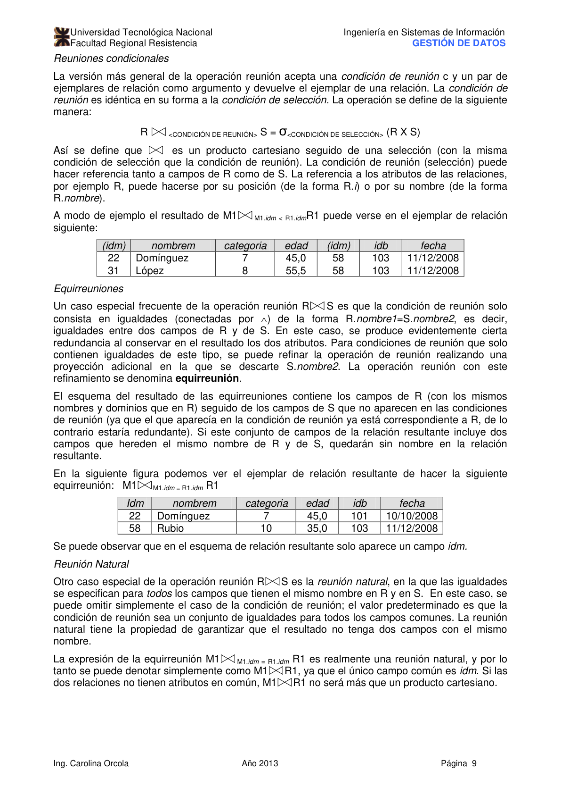
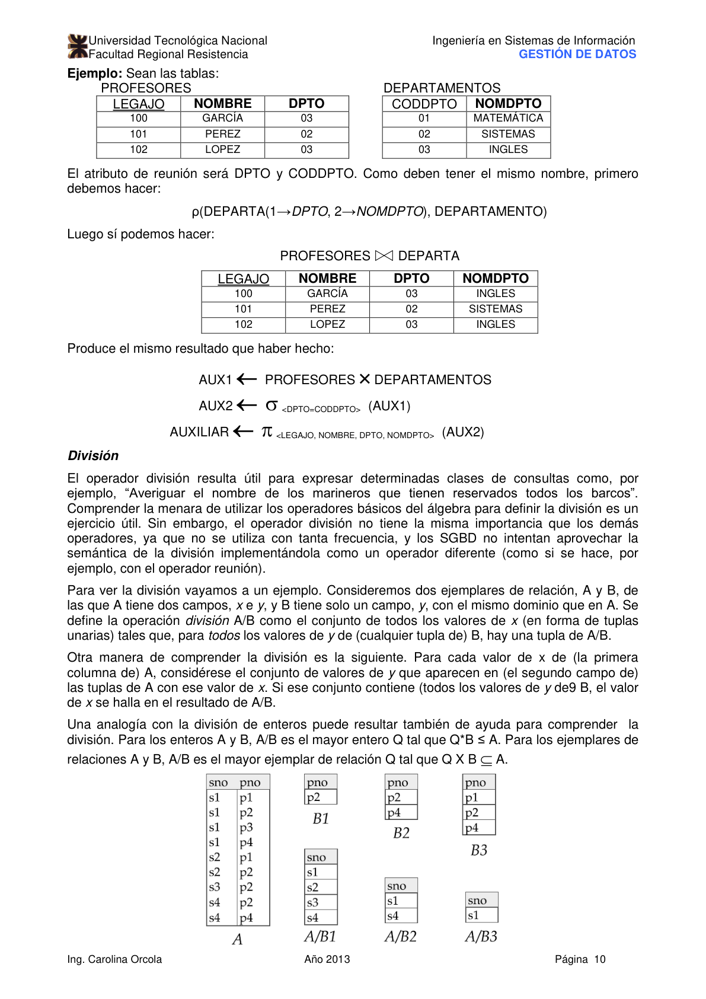
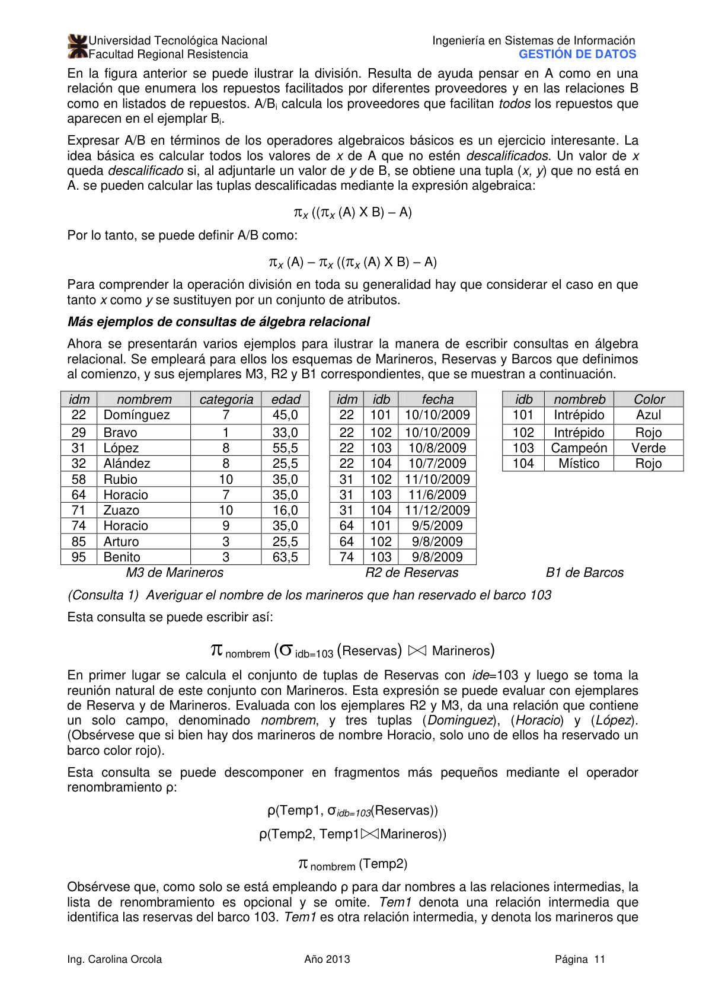
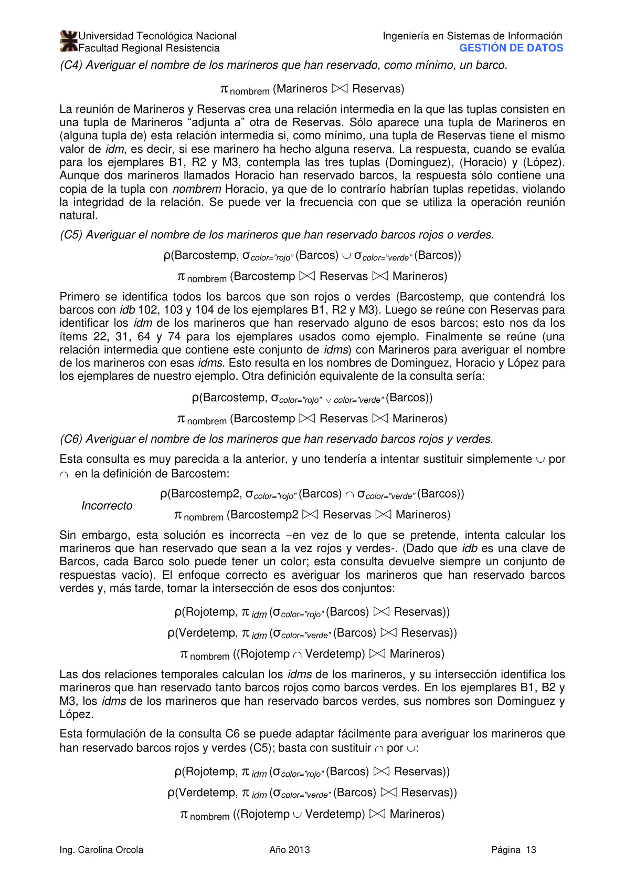
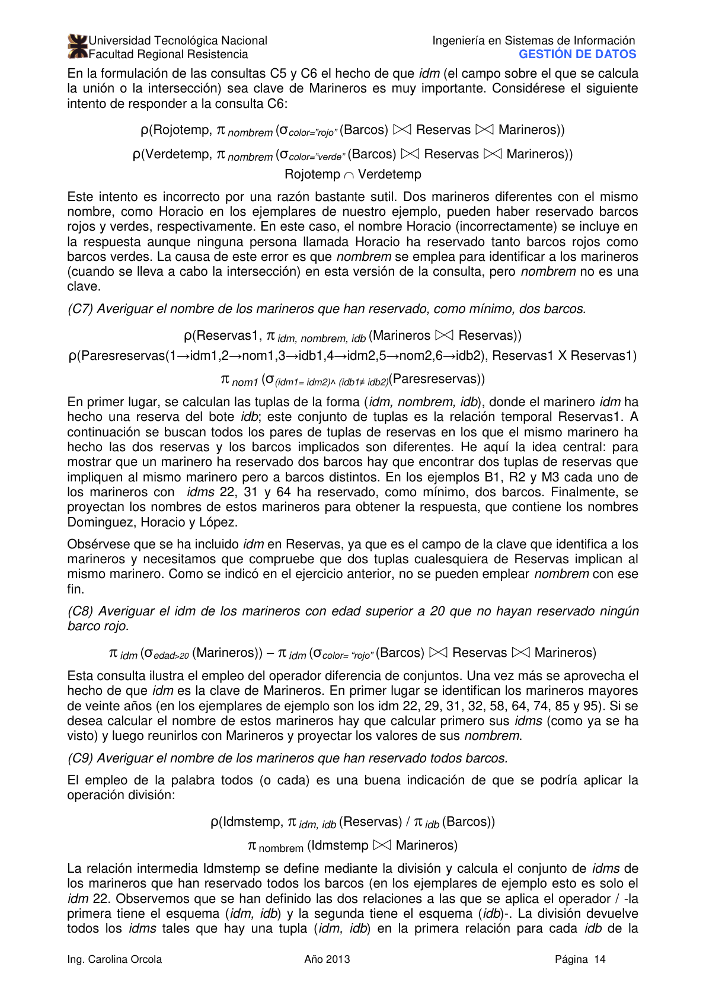

# Unidad IV: Álgebra y Cálculo Relacional

> **Gestión de Datos** — Ingeniería en Sistemas de Información, UTN-FRRE
>
> Profesora: Ing. Carolina Orcola
>
> Jefe de T.P.: Ing. Luis Eiman
>
> Auxiliar: Juan Carlos Fernández

---

## Índice

1. [Álgebra Relacional](#álgebra-relacional)
   - [Operaciones unitarias](#operaciones-unitarias)
   - [Operaciones de conjuntos](#operaciones-de-conjuntos)
   - [Reunión, División y Renombramiento](#reunión-división-y-renombramiento)
   - [Consultas de ejemplo](#consultas-de-ejemplo)
2. [Cálculo Relacional](#cálculo-relacional)
   - [Cálculo Relacional de Tuplas (CRT)](#cálculo-relacional-de-tuplas-crt)
   - [Cálculo Relacional de Dominios (CRD)](#cálculo-relacional-de-dominios-crd)
3. [Bibliografía](#bibliografía)

---

## Álgebra Relacional

El **Álgebra Relacional (AR)** es uno de los dos lenguajes formales de consultas asociados con el modelo relacional. Es un lenguaje **procedimental**: consta de un conjunto de operaciones que manipulan relaciones enteras. El resultado de cada operación es una nueva relación.

Las operaciones del AR se dividen en:

- **Operaciones unitarias** (sobre una sola relación): Selección (σ), Proyección (π), Renombramiento (ρ)
- **Operaciones de conjuntos** (sobre dos relaciones): Unión (∪), Diferencia (−), Intersección (∩), Producto Cartesiano (×)
- **Operaciones adicionales**: Reunión (⋈), División (/)

---

### Operaciones unitarias

#### Selección (σ)

La operación de **selección** devuelve las tuplas de una relación que satisfacen una condición dada.

```text
σ<condición>(R)
```

La condición puede usar: `=`, `≠`, `<`, `>`, `≤`, `≥`, y conectores lógicos `∧` (AND), `∨` (OR), `¬` (NOT).

**Ejemplo:** Recuperar los marineros con `categoría > 8` del ejemplar M2:

```text
σ_categoría > 8 (M2)
```



#### Proyección (π)

La operación de **proyección** devuelve ciertas columnas de una relación, eliminando duplicados.

```text
π<lista de atributos>(R)
```

**Ejemplo:** Obtener el nombre y categoría de los marineros con `categoría > 8`:

```text
π_nombre,categoría (σ_categoría > 8 (M2))
```



#### Renombramiento (ρ)

La operación de **renombramiento** permite cambiar el nombre de una relación o de sus atributos.

```text
ρ(NuevoNombre, R)
ρ(NuevoNombre(1→nuevo_atrib1, 2→nuevo_atrib2), R)
```

---

### Operaciones de conjuntos

Para aplicar Unión, Diferencia e Intersección, las relaciones deben ser **compatibles en unión**: mismo número de campos y dominios compatibles en cada posición.

#### Unión (∪)

Devuelve todas las tuplas que aparecen en R **o** en S (sin duplicados).

```text
R ∪ S
```

#### Diferencia (−)

Devuelve las tuplas que aparecen en R pero **no** en S.

```text
R − S
```

#### Intersección (∩)

Devuelve las tuplas que aparecen en R **y** en S.

```text
R ∩ S
```

**Nota:** `R ∩ S = R − (R − S)`



#### Producto Cartesiano (×)

Devuelve todas las combinaciones posibles de tuplas de R y S.

```text
R × S
```

El esquema resultante tiene todos los campos de R seguidos de todos los de S. Si R tiene n tuplas y S tiene m tuplas, R × S tiene n×m tuplas. Generalmente se combina con selección y proyección.



---

### Reunión, División y Renombramiento

#### Reunión condicional (⋈_c)

La versión más general acepta una condición `c`:

```text
R ⋈_c S = σ_c (R × S)
```

Es más eficiente que el producto cartesiano cuando la condición filtra muchas tuplas.



#### Equirreunión

Reunión condicional donde la condición es una igualdad entre atributos. El resultado contiene columnas duplicadas para los atributos de reunión.

#### Reunión natural (⋈)

Reunión donde la condición iguala **todos** los campos con el mismo nombre. Elimina las columnas duplicadas del resultado.

```text
R ⋈ S
```

**Ejemplo:** Reunión natural entre PROFESORES y DEPARTAMENTOS usando DPTO = CODDPTO. Primero se renombra:

```text
ρ(DEPARTA(1→DPTO, 2→NOMDPTO), DEPARTAMENTOS)
PROFESORES ⋈ DEPARTA
```



#### División (/)

Dadas relaciones R(x, y) y S(y), `R / S` devuelve todas las x tales que para **toda** tupla y en S, existe una tupla (x, y) en R.

```text
R / S
```

Es útil para consultas del tipo "todos los…" o "para todos los…".



**Expresión de la división con operadores básicos:**

```text
T1 ← π_x(R)
T2 ← π_x((T1 × S) − R)
R / S = T1 − T2
```

---

### Consultas de ejemplo

Las consultas se formulan sobre las relaciones **Marineros(idm, nombrem, categoría, edad)**, **Barcos(idb, nombreb, color)** y **Reservas(idm, idb, día)**.

**(C1)** Averiguar los nombres e identificadores de todos los marineros con categoría superior a 7:

```text
π_idm,nombrem (σ_categoría>7 (Marineros))
```

**(C2)** Averiguar los nombres de los marineros que han reservado el barco 103:

```text
π_nombrem (σ_idb=103 (Reservas ⋈ Marineros))
```

**(C3)** Averiguar los colores de los barcos reservados por Lubito:

```text
π_color (σ_nombrem='Lubito' (Marineros ⋈ Reservas ⋈ Barcos))
```

**(C4)** Averiguar el nombre de los marineros que han reservado, como mínimo, un barco:

```text
π_nombrem (Marineros ⋈ Reservas)
```



**(C5)** Averiguar los idm de los marineros que han reservado un barco rojo **o** uno verde:

```text
ρ(Rojotemp, π_idm (σ_color='rojo' (Barcos) ⋈ Reservas))
ρ(Verdetemp, π_idm (σ_color='verde' (Barcos) ⋈ Reservas))
Rojotemp ∪ Verdetemp
```

**(C6)** Averiguar los idm de los marineros que han reservado un barco rojo **y** uno verde:

```text
ρ(Rojotemp, π_idm (σ_color='rojo' (Barcos) ⋈ Reservas))
ρ(Verdetemp, π_idm (σ_color='verde' (Barcos) ⋈ Reservas))
Rojotemp ∩ Verdetemp
```

**(C7)** Averiguar los nombres de los marineros que han reservado, como mínimo, un barco rojo:

```text
π_nombrem ((σ_color='rojo' (Barcos)) ⋈ Reservas ⋈ Marineros)
```

**(C8)** Averiguar los nombres de los marineros que han reservado, como mínimo, un barco rojo o uno verde:

```text
ρ(Temp, π_nombrem ((σ_color='rojo'∨color='verde' (Barcos)) ⋈ Reservas ⋈ Marineros))
π_nombrem (Temp)
```



**(C9)** Averiguar los nombres de los marineros que han reservado, como mínimo, dos barcos distintos:

```text
ρ(Reservas1(1→idm1, 2→idb1, 3→día1), Reservas)
ρ(Reservas2(1→idm2, 2→idb2, 3→día2), Reservas)
π_nombrem (σ_idm1=idm2 ∧ idb1≠idb2 (Reservas1 × Reservas2) ⋈ Marineros)
```

**(C10)** Averiguar el nombre de los marineros que han reservado **todos** los barcos llamados Intrépido:

```text
ρ(Idmstemp, π_idm,idb (Reservas) / π_idb (σ_nombreb='Intrépido' (Barcos)))
π_nombrem (Idmstemp ⋈ Marineros)
```


**(C11)** Averiguar el nombre de los marineros que han reservado **todos** los barcos:

```text
ρ(Idmstemp, π_idm,idb (Reservas) / π_idb (Barcos))
π_nombrem (Idmstemp ⋈ Marineros)
```

**(C12)** Calcular el marinero de mayor categoría:

```text
ρ(M1, Marineros)
ρ(M2, Marineros)
π_nombrem (Marineros) − π_M1.nombrem (σ_M1.categoría < M2.categoría (M1 × M2))
```

---

## Cálculo Relacional

El **Cálculo Relacional** es un lenguaje de consultas **no procedimental**: describe la información deseada sin dar un procedimiento específico para obtenerla. Se basa en el cálculo de predicados de primer orden.

Hay dos variantes:

| Variante | Variable sobre… |
|---|---|
| Cálculo Relacional de Tuplas (CRT) | tuplas completas |
| Cálculo Relacional de Dominios (CRD) | valores de dominio (campos) |

Ambos son equivalentes en poder expresivo al Álgebra Relacional (**completitud relacional**).

---

### Cálculo Relacional de Tuplas (CRT)

Una consulta en CRT tiene la forma:

```text
{ T | p(T) }
```

donde `T` es una **variable tupla** y `p(T)` es una **fórmula** que describe las propiedades de las tuplas buscadas. El resultado es el conjunto de todas las tuplas T para las cuales la fórmula se evalúa como verdadera.

#### Átomos

Una fórmula está compuesta por átomos:

1. `R(T)` — T es una tupla de la relación R
2. `T.a op S.b` — comparación entre atributos de variables tupla
3. `T.a op constante` — comparación con un valor fijo

donde `op` ∈ `{=, ≠, <, >, ≤, ≥}`.

#### Fórmulas

Las fórmulas se construyen con:

- Átomos atómicos
- `¬f`, `f₁ ∧ f₂`, `f₁ ∨ f₂` (negación, conjunción, disyunción)
- `∃T(f)` — existe una tupla T tal que f es verdadera
- `∀T(f)` — para toda tupla T, f es verdadera

#### Ejemplos CRT

**(C11)** Averiguar todos los marineros con categoría superior a 7:

```text
{ M | M ∈ Marineros ∧ M.categoría > 7 }
```

**(C2)** Nombre de los marineros que han reservado el barco 103:

```text
{ M.nombrem | M ∈ Marineros ∧ ∃R ∈ Reservas (R.idm = M.idm ∧ R.idb = 103) }
```

**(C6)** Idm de los marineros que han reservado un barco rojo y uno verde:

```text
{ M.idm | M ∈ Marineros
  ∧ ∃R1 ∈ Reservas (R1.idm = M.idm ∧ ∃B1 ∈ Barcos (B1.idb = R1.idb ∧ B1.color = 'rojo'))
  ∧ ∃R2 ∈ Reservas (R2.idm = M.idm ∧ ∃B2 ∈ Barcos (B2.idb = R2.idb ∧ B2.color = 'verde')) }
```

**(C11)** Marineros que han reservado todos los barcos:

```text
{ M.nombrem | M ∈ Marineros
  ∧ ∀B ∈ Barcos (∃R ∈ Reservas (R.idm = M.idm ∧ R.idb = B.idb)) }
```

---

### Cálculo Relacional de Dominios (CRD)

Una consulta en CRD tiene la forma:

```text
{ ⟨x₁, x₂, …, xₙ⟩ | p(x₁, x₂, …, xₙ) }
```

donde `x₁, …, xₙ` son **variables de dominio** (representan valores de atributos individuales) y `p` es una fórmula. El resultado es el conjunto de las n-uplas de valores de dominio para los cuales la fórmula es verdadera.

#### Ejemplos CRD

**(C1)** Averiguar los idm y nombres de los marineros con categoría superior a 7:

```text
{ ⟨I, N⟩ | ∃C ∃E (⟨I, N, C, E⟩ ∈ Marineros ∧ C > 7) }
```

**(C2)** Nombre de los marineros que han reservado el barco 103:

```text
{ ⟨N⟩ | ∃I ∃C ∃E (⟨I, N, C, E⟩ ∈ Marineros
         ∧ ∃Id ∃D (⟨I, Id, D⟩ ∈ Reservas ∧ Id = 103)) }
```

---

## Bibliografía

1. *"Sistema de Administración de Bases de Datos"*; Raghu Ramakrishnan / Johannes Gehrke; Mc Graw Hill, 3ª Edición, edición en español — 2007
2. *"Fundamentos de Sistemas de Bases de Datos"*; Elmasri y Navathe; Addison Wesley; 3ª Edición; Madrid; 2002
3. *"Introduction to Database Systems"*; C. J. Date; Addison Wesley; 8ª Edición; 2004
