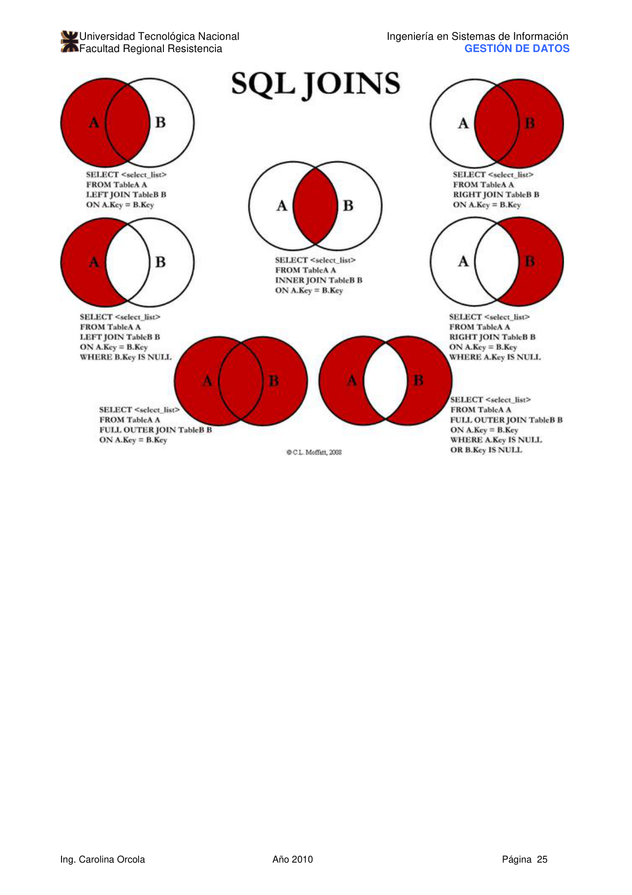
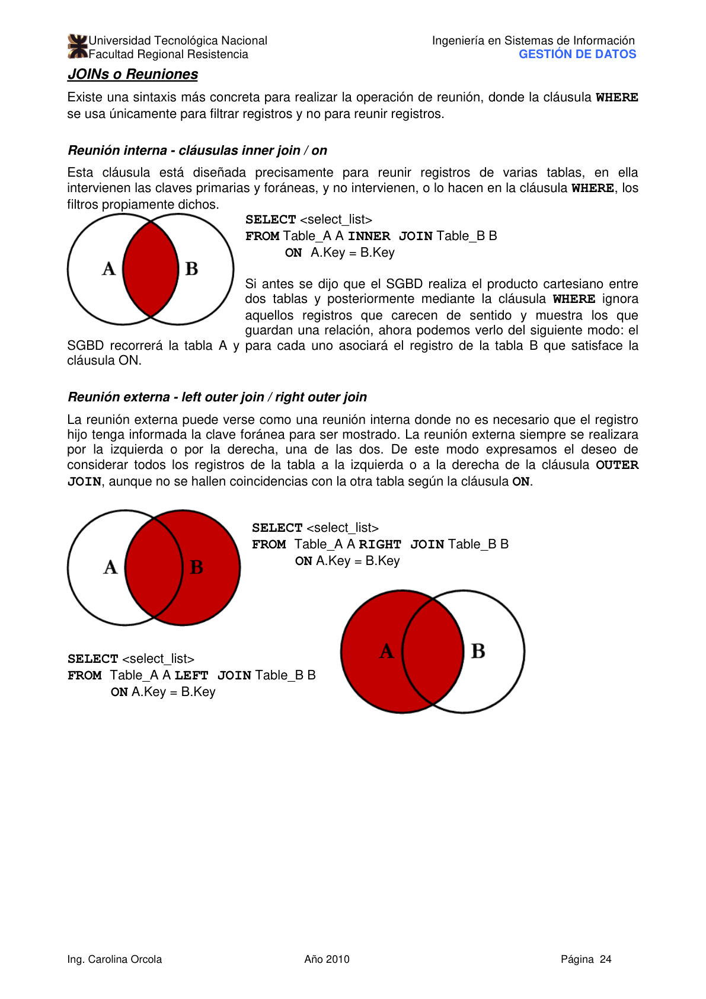

# Unidad V: SQL

> **Gestión de Datos** — Ingeniería en Sistemas de Información, UTN-FRRE
>
> Profesora: Ing. Carolina Orcola
>
> Jefe de T.P.: Ing. Luis Eiman
>
> Auxiliar: Juan Carlos Fernández

---

## Índice

- [Unidad V: SQL](#unidad-v-sql)
  - [Índice](#índice)
  - [Introducción](#introducción)
  - [Consultas básicas](#consultas-básicas)
    - [Sintaxis SELECT-FROM-WHERE](#sintaxis-select-from-where)
    - [Expresiones y cadenas de caracteres](#expresiones-y-cadenas-de-caracteres)
    - [Otros predicados](#otros-predicados)
      - [BETWEEN](#between)
      - [IN / NOT IN](#in--not-in)
      - [IS NULL / IS NOT NULL](#is-null--is-not-null)
      - [ALL / ANY / SOME](#all--any--some)
      - [EXISTS / NOT EXISTS](#exists--not-exists)
  - [Subconsultas o consultas anidadas](#subconsultas-o-consultas-anidadas)
  - [UNION, INTERSECT y EXCEPT](#union-intersect-y-except)
    - [UNION](#union)
    - [INTERSECT](#intersect)
    - [EXCEPT](#except)
  - [Consultas anidadas correlacionadas](#consultas-anidadas-correlacionadas)
  - [Operadores de agregación](#operadores-de-agregación)
  - [ORDER BY, GROUP BY y HAVING](#order-by-group-by-y-having)
    - [ORDER BY](#order-by)
    - [GROUP BY](#group-by)
    - [HAVING](#having)
  - [Valores nulos](#valores-nulos)
    - [Lógica de tres valores](#lógica-de-tres-valores)
    - [NULL en operaciones de agregación](#null-en-operaciones-de-agregación)
    - [Reuniones externas](#reuniones-externas)
  - [JOINs o Reuniones](#joins-o-reuniones)
    - [INNER JOIN](#inner-join)
    - [LEFT JOIN / RIGHT JOIN](#left-join--right-join)
  - [Bibliografía](#bibliografía)

---

## Introducción

El **Lenguaje Estructurado de Consultas** (_Structured Query Language_, SQL) es el lenguaje
comercial de bases de datos relacionales más utilizado. Sus orígenes están ligados al lenguaje
SEQUEL, desarrollado por IBM en los años 70 como parte del proyecto System R.

SQL es un lenguaje **no procedimental** a nivel de consultas, aunque el estándar incorpora también
características procedimentales. Las principales características de SQL son:

- **Lenguaje de Definición de Datos (DDL)**: comandos para crear, modificar y eliminar esquemas de
  relaciones.
- **Lenguaje de Manipulación de Datos (DML)**: comandos para insertar, eliminar, modificar y
  consultar tuplas.
- **Restricciones de integridad**: especificación de restricciones que deben cumplir los datos.
- **Definición de vistas**: creación de vistas sobre las relaciones base.
- **Control de transacciones**: inicio y fin de transacciones.
- **SQL incorporado y SQL dinámico**: llamadas a código SQL desde lenguajes anfitriones como C o
  COBOL.
- **Control de acceso**: especificación de privilegios de acceso a relaciones y vistas.

SQL se basa en el **álgebra relacional y el cálculo relacional**. Los planes de ejecución de
consultas SQL se presentan como variaciones de expresiones del álgebra relacional.

---

## Consultas básicas

### Sintaxis SELECT-FROM-WHERE

La forma básica de una consulta SQL es:

```sql
SELECT [DISTINCT] lista-de-selección
FROM   lista-de-tablas
WHERE  condición
```

- **`lista-de-tablas`**: lista de nombres de tabla. Cada nombre puede ir seguido de una variable de
  rango (alias).
- **`lista-de-selección`**: columnas o expresiones que se desea recuperar. Se pueden prefijar con la
  variable de rango.
- **`condición`**: combinación booleana (`AND`, `OR`, `NOT`) de comparaciones (`<`, `<=`, `=`, `<>`,
  `>=`, `>`).
- **`DISTINCT`**: opcional; elimina filas duplicadas del resultado. Sin él, el resultado es un
  **multiconjunto**.

**Estrategia de evaluación conceptual:**

1. Calcular el producto cartesiano de las tablas en `FROM`.
2. Eliminar filas que no cumplan la condición `WHERE`.
3. Eliminar columnas que no aparezcan en `SELECT`.
4. Si se especifica `DISTINCT`, eliminar filas repetidas.

**Ejemplo — (C15)** Averiguar el nombre y la edad de todos los marineros:

```sql
SELECT DISTINCT M.nombrem, M.edad
FROM   Marineros M
```

**Ejemplo — (C11)** Averiguar todos los marineros con categoría superior a 7:

```sql
SELECT M.idm, M.nombrem, M.categoría, M.edad
FROM   Marineros AS M
WHERE  M.categoría > 7
```

> La cláusula `SELECT` realiza **proyecciones**; las **selecciones** del álgebra relacional se
> expresan con `WHERE`. Este desajuste en la nomenclatura es un accidente histórico.

**Ejemplo — (C1)** Averiguar el nombre de los marineros que han reservado el barco 103:

```sql
SELECT M.nombrem
FROM   Marineros M, Reservas R
WHERE  M.idm = R.idm AND R.idb = 103
```

**Ejemplo — (C2)** Averiguar el nombre de los marineros que han reservado barcos rojos:

```sql
SELECT M.nombrem
FROM   Marineros M, Reservas R, Barcos B
WHERE  M.idm = R.idm AND R.idb = B.idb AND B.color = 'rojo'
```

**Ejemplo — (C4)** Averiguar el nombre de los marineros que han reservado, como mínimo, un barco:

```sql
SELECT M.nombrem
FROM   Marineros M, Reservas R
WHERE  M.idm = R.idm
```

---

### Expresiones y cadenas de caracteres

Cada elemento de la lista `SELECT` puede tener la forma `expresión AS nombre-columna`:

**Ejemplo — (C17)** Calcular el incremento de categoría de quienes navegaron en dos barcos distintos
el mismo día:

```sql
SELECT M.nombrem, M.categoría + 1 AS categoría
FROM   Marineros M, Reservas R1, Reservas R2
WHERE  M.idm = R1.idm AND M.idm = R2.idm
  AND  R1.fecha = R2.fecha AND R1.idb <> R2.idb
```

**Operador LIKE**: permite comparar cadenas con patrones usando `%` (cero o más caracteres) y `_`
(un carácter exacto).

**Ejemplo — (C18)** Averiguar la edad de los marineros cuyo nombre comienza con B, acaba con O y
tiene al menos seis caracteres:

```sql
SELECT M.edad
FROM   Marineros M
WHERE  M.nombrem LIKE 'B_%___O'
```

---

### Otros predicados

#### BETWEEN

```sql
SELECT columnas
FROM   tabla
WHERE  columna BETWEEN límite1 AND límite2
```

Ejemplo: marineros con edad entre 20 y 35:

```sql
SELECT M.nombrem
FROM   Marineros M
WHERE  M.edad BETWEEN 20 AND 35
```

#### IN / NOT IN

```sql
SELECT columnas
FROM   tabla
WHERE  columna [NOT] IN (valor1, valor2, …, valorN)
```

Ejemplo: marineros con edad 15, 20 o 35:

```sql
SELECT M.nombrem
FROM   Marineros M
WHERE  M.edad IN (15, 20, 35)
```

#### IS NULL / IS NOT NULL

```sql
SELECT columnas
FROM   tabla
WHERE  columna IS [NOT] NULL
```

Ejemplo: marineros sin hijos registrados:

```sql
SELECT M.nombrem
FROM   Marineros M
WHERE  M.hijos IS NULL
```

#### ALL / ANY / SOME

```sql
SELECT columnas
FROM   tabla
WHERE  columna operador {ALL | ANY | SOME} subconsulta
```

Ejemplo — barcos reservados **solo** por marineros mayores de 18:

```sql
SELECT R.idb
FROM   Reservas R
WHERE  R.idm = ALL (SELECT M.idm
                    FROM   Marineros M
                    WHERE  M.edad >= 18)
```

Ejemplo — barcos reservados por **al menos un** marinero mayor de 18:

```sql
SELECT R.idb
FROM   Reservas R
WHERE  R.idm = ANY (SELECT M.idm
                    FROM   Marineros M
                    WHERE  M.edad >= 18)
```

#### EXISTS / NOT EXISTS

```sql
SELECT columnas
FROM   tabla
WHERE  [NOT] EXISTS subconsulta
```

Ejemplo: marineros que reservaron el barco 103:

```sql
SELECT M.idm, M.nombrem
FROM   Marineros M
WHERE  EXISTS (SELECT R.idm
               FROM   Reservas R
               WHERE  R.idb = 103)
```

---

## Subconsultas o consultas anidadas

Una **subconsulta** es una consulta incluida en la cláusula `WHERE` o `HAVING` de otra consulta. Se
usa cuando la condición requiere calcular un valor intermedio.

**Ejemplo**: nombre de los marineros con la categoría máxima:

```sql
SELECT M.nombrem
FROM   Marineros M
WHERE  M.categoría = (SELECT MAX(M2.categoría)
                      FROM   Marineros M2)
```

**Ejemplo — (C1) con IN anidado**: marineros que reservaron el barco 103:

```sql
SELECT M.nombrem
FROM   Marineros M
WHERE  M.idm IN (SELECT R.idm
                 FROM   Reservas R
                 WHERE  R.idb = 103)
```

**Ejemplo — (C2) con varios niveles de anidamiento**: nombre de los marineros que reservaron barcos
rojos:

```sql
SELECT M.nombrem
FROM   Marineros M
WHERE  M.idm IN (SELECT R.idm
                 FROM   Reservas R
                 WHERE  R.idb IN (SELECT B.idb
                                  FROM   Barcos B
                                  WHERE  B.color = 'rojo'))
```

---

## UNION, INTERSECT y EXCEPT

SQL soporta operaciones de conjuntos entre resultados compatibles en unión (mismo número de columnas
con dominios compatibles).

Por defecto, estas operaciones **eliminan duplicados**; usar `ALL` para conservarlos.

### UNION

```sql
SELECT columna FROM tabla [WHERE condiciones]
UNION [ALL]
SELECT columna FROM tabla [WHERE condiciones]
```

**Ejemplo — (C5)** Marineros que reservaron barcos rojos **o** verdes:

```sql
SELECT M.nombrem
FROM   Marineros M, Reservas R, Barcos B
WHERE  M.idm = R.idm AND R.idb = B.idb AND B.color = 'rojo'
UNION
SELECT M2.nombrem
FROM   Marineros M2, Reservas R2, Barcos B2
WHERE  M2.idm = R2.idm AND R2.idb = B2.idb AND B2.color = 'verde'
```

### INTERSECT

```sql
SELECT columna FROM tabla [WHERE condiciones]
INTERSECT [ALL]
SELECT columna FROM tabla [WHERE condiciones]
```

**Ejemplo — (C6)** Marineros que reservaron barcos rojos **y** verdes:

```sql
SELECT M.nombrem
FROM   Marineros M, Reservas R, Barcos B
WHERE  M.idm = R.idm AND R.idb = B.idb AND B.color = 'rojo'
INTERSECT
SELECT M2.nombrem
FROM   Marineros M2, Reservas R2, Barcos B2
WHERE  M2.idm = R2.idm AND R2.idb = B2.idb AND B2.color = 'verde'
```

También se puede expresar con `IN`:

```sql
SELECT M.nombrem
FROM   Marineros M, Reservas R, Barcos B
WHERE  M.idm = R.idm AND R.idb = B.idb AND B.color = 'rojo'
  AND  M.idm IN (SELECT M2.idm
                 FROM   Marineros M2, Reservas R2, Barcos B2
                 WHERE  M2.idm = R2.idm AND R2.idb = B2.idb AND B2.color = 'verde')
```

### EXCEPT

```sql
SELECT columna FROM tabla [WHERE condiciones]
EXCEPT [ALL]
SELECT columna FROM tabla [WHERE condiciones]
```

**Ejemplo — (C19)** Marineros que reservaron barcos rojos pero **no** verdes:

```sql
SELECT R.idm
FROM   Reservas R, Barcos B
WHERE  R.idb = B.idb AND B.color = 'rojo'
EXCEPT
SELECT R2.idm
FROM   Reservas R2, Barcos B2
WHERE  R2.idb = B2.idb AND B2.color = 'verde'
```

**Ejemplo — (C20)** Marineros con categoría 10 o que reservaron el barco 104:

```sql
SELECT M.idm
FROM   Marineros M
WHERE  M.categoría = 10
UNION
SELECT R.idm
FROM   Reservas R
WHERE  R.idb = 104
```

---

## Consultas anidadas correlacionadas

En una **consulta correlacionada**, la subconsulta interior depende de la fila que se examina en la
consulta exterior.

**Ejemplo — (C1) con EXISTS correlacionado**:

```sql
SELECT M.nombrem
FROM   Marineros M
WHERE  EXISTS (SELECT *
               FROM   Reservas R
               WHERE  R.idb = 103 AND R.idm = M.idm)
```

Para cada fila `M` de Marineros, se evalúa si existe alguna reserva del barco 103 hecha por ese
marinero.

**Ejemplo — (C9)** Marineros que han reservado **todos** los barcos (división con NOT EXISTS):

```sql
SELECT M.nombrem
FROM   Marineros M
WHERE  NOT EXISTS (SELECT B.idb
                   FROM   Barcos B
                   EXCEPT
                   SELECT R.idb
                   FROM   Reservas R
                   WHERE  R.idm = M.idm)
```

Versión alternativa sin EXCEPT:

```sql
SELECT M.nombrem
FROM   Marineros M
WHERE  NOT EXISTS (SELECT B.idb
                   FROM   Barcos B
                   WHERE  NOT EXISTS (SELECT R.idb
                                      FROM   Reservas R
                                      WHERE  R.idb = B.idb AND R.idm = M.idm))
```

---

## Operadores de agregación

SQL soporta cinco operadores de agregación aplicables a cualquier columna:

| Operador                | Descripción                  |
| ----------------------- | ---------------------------- |
| `COUNT([DISTINCT] col)` | Número de valores (únicos)   |
| `SUM([DISTINCT] col)`   | Suma de valores (únicos)     |
| `AVG([DISTINCT] col)`   | Promedio de valores (únicos) |
| `MAX(col)`              | Valor máximo                 |
| `MIN(col)`              | Valor mínimo                 |

**Ejemplo — (C25)** Promedio de edad de los marineros:

```sql
SELECT AVG(M.edad)
FROM   Marineros M
```

**Ejemplo — (C26)** Promedio de edad de marineros con categoría 10:

```sql
SELECT AVG(M.edad)
FROM   Marineros M
WHERE  M.categoría = 10
```

**Ejemplo** — marinero más joven con su nombre (requiere subconsulta):

```sql
SELECT M.nombrem, M.edad
FROM   Marineros M
WHERE  M.edad = (SELECT MIN(M2.edad)
                 FROM   Marineros M2)
```

**Ejemplo — (C28)** Contar el número de marineros:

```sql
SELECT COUNT(*)
FROM   Marineros M
```

**Ejemplo — (C29)** Contar nombres distintos:

```sql
SELECT COUNT(DISTINCT M.nombrem)
FROM   Marineros M
```

**Ejemplo — (C30)** Marineros de más edad que el marinero más viejo de categoría 10:

```sql
SELECT M.nombrem
FROM   Marineros M
WHERE  M.edad > (SELECT MAX(M2.edad)
                 FROM   Marineros M2
                 WHERE  M2.categoría = 10)
```

---

## ORDER BY, GROUP BY y HAVING

### ORDER BY

Ordena el resultado por una o más columnas. Por defecto el orden es ascendente; `DESC` para
descendente.

```sql
SELECT [DISTINCT] columnas
FROM   tablas
[WHERE condiciones]
[ORDER BY columna [DESC] [, columna2 [DESC] …]]
```

### GROUP BY

Permite aplicar operaciones de agregación a **grupos** de filas. Las columnas en `SELECT` deben
aparecer también en `GROUP BY` (salvo que estén dentro de un agregado).

```sql
SELECT [DISTINCT] columnas
FROM   tablas
[WHERE condiciones]
GROUP BY columnas-de-agrupación
[HAVING condición-sobre-grupos]
[ORDER BY columna [DESC] …]
```

**Ejemplo — (C31)** Edad del marinero más joven de cada categoría:

```sql
SELECT M.categoría, MIN(M.edad)
FROM   Marineros M
GROUP BY M.categoría
```

### HAVING

Filtra **grupos** (funciona como `WHERE` pero para grupos formados por `GROUP BY`). Siempre va
después de `GROUP BY`.

**Ejemplo — (C32)** Edad del marinero más joven con derecho a voto (>18) para cada categoría con al
menos dos marineros con derecho a voto:

```sql
SELECT M.categoría, MIN(M.edad) AS edadmín
FROM   Marineros M
WHERE  M.edad >= 18
GROUP BY M.categoría
HAVING COUNT(*) > 1
```

**Pasos de evaluación:**

1. Calcular producto cartesiano (solo Marineros aquí).
1. Aplicar `WHERE M.edad >= 18`.
1. Eliminar columnas innecesarias.
1. Ordenar por `GROUP BY M.categoría`.
1. Aplicar `HAVING COUNT(*) > 1`.
1. Generar una fila por grupo restante.

**Ejemplo — (C33)** Para cada barco rojo, número de reservas:

```sql
SELECT B.idb, COUNT(*) AS numreservas
FROM   Barcos B, Reservas R
WHERE  B.idb = R.idb AND B.color = 'rojo'
GROUP BY B.idb
```

**Ejemplo — (C34)** Edad media de marineros por categoría con al menos dos marineros:

```sql
SELECT M.categoría, AVG(M.edad) AS edadmedia
FROM   Marineros M
GROUP BY M.categoría
HAVING COUNT(*) > 1
```

**Ejemplo — (C37)** Categorías con la edad media mínima (con tabla temporal en `FROM`):

```sql
SELECT Temp.categoría, Temp.edadmedia
FROM   (SELECT M.categoría, AVG(M.edad) AS edadmedia
        FROM   Marineros M
        GROUP BY M.categoría) AS Temp
WHERE  Temp.edadmedia = (SELECT MIN(Temp2.edadmedia)
                         FROM   (SELECT AVG(M2.edad) AS edadmedia
                                 FROM   Marineros M2
                                 GROUP BY M2.categoría) AS Temp2)
```

> Las operaciones de agregación **no se pueden anidar directamente** (`MIN(AVG(...))` es ilegal).
> Hay que usar subconsultas con tablas temporales.

---

## Valores nulos

SQL usa el valor especial **NULL** para representar valores desconocidos o inaplicables.

### Lógica de tres valores

Las comparaciones con NULL producen un tercer valor: **desconocido** (además de verdadero y falso).

| Expresión                       | Resultado   |
| ------------------------------- | ----------- |
| `NULL = NULL`                   | desconocido |
| `NOT NULL`                      | NULL        |
| `Verdadero OR Verdadero`        | Verdadero   |
| `Falso/NULL OR NULL`            | NULL        |
| `Verdadero AND Verdadero`       | Verdadero   |
| `Verdadero/Falso/NULL AND NULL` | NULL        |
| `Verdadero/Falso AND Falso`     | Falso       |

La cláusula `WHERE` elimina filas cuya condición sea **falsa o NULL** (no solo falsa).

### NULL en operaciones de agregación

- `COUNT(*)` cuenta filas NULL igual que las demás.
- `SUM`, `AVG`, `MIN`, `MAX`, `COUNT(col)` **descartan** los valores NULL.
- Si se aplican solo a valores NULL, devuelven NULL (excepto `COUNT` que devuelve 0).

### Reuniones externas

Las **reuniones externas** incluyen en el resultado filas sin correspondencia, rellenando con NULL
las columnas de la tabla sin pareja.

| Tipo                 | Descripción                                   |
| -------------------- | --------------------------------------------- |
| `LEFT [OUTER] JOIN`  | Incluye todas las filas de la tabla izquierda |
| `RIGHT [OUTER] JOIN` | Incluye todas las filas de la tabla derecha   |
| `FULL OUTER JOIN`    | Incluye todas las filas de ambas tablas       |

**Ejemplo**: pares [idm, idb] de marineros y los barcos que reservaron (incluyendo marineros sin
reservas):

```sql
SELECT M.idm, R.idb
FROM   Marineros M NATURAL LEFT OUTER JOIN Reservas R
```

`NATURAL` especifica que la condición de reunión es la igualdad en todos los atributos comunes.

Para prevenir valores NULL en una columna: `nombrem CHAR(20) NOT NULL`. Los campos de clave primaria
nunca admiten NULL.

---

## JOINs o Reuniones

Existe una sintaxis explícita para reuniones donde la cláusula `WHERE` se usa únicamente para
filtrar (no para reunir).



### INNER JOIN

```sql
SELECT <select_list>
FROM   Table_A A INNER JOIN Table_B B
       ON A.Key = B.Key
```

Devuelve solo las filas con correspondencia en ambas tablas.

### LEFT JOIN / RIGHT JOIN

```sql
SELECT <select_list>
FROM   Table_A A LEFT JOIN Table_B B
       ON A.Key = B.Key
```

```sql
SELECT <select_list>
FROM   Table_A A RIGHT JOIN Table_B B
       ON A.Key = B.Key
```

La reunión externa incluye todos los registros de la tabla indicada (izquierda o derecha) aunque no
tengan correspondencia en la otra; los campos sin pareja toman valor NULL.



---

## Bibliografía

1. _"Sistema de Administración de Bases de Datos"_; Raghu Ramakrishnan / Johannes Gehrke; Mc Graw
   Hill, 3ª Edición, edición en español — 2007
2. _"Fundamentos de Sistemas de Bases de Datos"_; Elmasri y Navathe; Addison Wesley; 3ª Edición;
   Madrid; 2002
3. _"Introduction to Database Systems"_; C. J. Date; Addison Wesley; 8ª Edición; 2004
